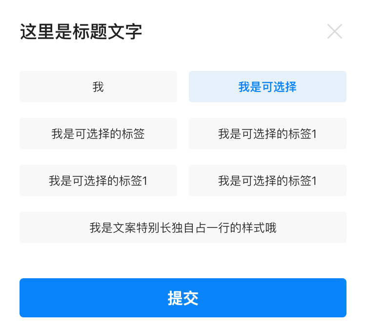

# BrnSelectTagsWithInputPicker

可作为当操作“驳回/无效”等场景时用来填写原因的简单录入。

## 一、效果总览



## 二、描述

### 组件元素

1. 选择标签
2. 文本输入框
3. 操作按钮
4. 关闭icon

### 交互规则

1. 每个标签均可设定是否需要额外的输入信息，如果需要额外的输入信息，则Picker展示输入框；
2. 标签为多选时，如果其中一个需要额外的输入信息，则输入框展示；

### 使用规范

1. 可选标签数为 2-8 个，不可超过8个。当标签内文字间距左右padding小于8px，则该标签需单独占一行位置并置于标签顺序的最后位置；
2. 文本输入框可为常驻必填项，或常驻选填项，或可通过点击某一标签出现出入框；
3. 此类picker组件仅可通过点击“关闭”icon或“操作按钮”进行消失。点击页面黑色遮罩处，不会触发picker消失。

## 三、构造函数及参数配置

### 构造函数


```dart
const BrnSelectTagsWithInputPicker(
      {this.maxLength = 200,
      this.hintText = "请输入",
      this.title = "",
      this.confirm,
      this.cancelCallBack,
      this.cursorColor,
      this.forceShowTextInput = false,
      this.multiSelect = false,
      this.defaultText,
      this.textEditingController,
      required this.tagPickerConfig,
      required this.onTagValueGetter}); 
```
### 参数配置

| 参数名 | 参数类型 | 描述 | 是否必填 | 默认值 |
| --- | --- | --- | --- | --- |
| title | String | Picker显示标题 | 否 | 空字符串 |
| hintText | String | 默认输入框提示文本 | 否 | 请输入 |
| maxLength | int | 输入框最长文本字符数 | 否 | 200 |
| confirm | BrnTagInputConfirmClickCallback? | 点击“确定”按钮事件回调 | 否 | - |
| cancelCallBack | BrnTagInputCancelClickCallBack? | 关闭Picker事件回调 | 否 | - |
| cursorColor | Color? | 输入框光标颜色 | 否 | 主题色 |
| defaultText | String? | 输入框默认文本 | 否 | 空字符串 |
| forceShowTextInput | bool | 强制显示输入框 | 否 | FALSE |
| multiSelect | bool | 标签是否多选 | 否 | FALSE |
| tagPickerConfig | BrnTagsInputPickerConfig | 标签数据源 | 是 | null |
| onTagValueGetter | SelectTagWithInputValueGetter | 标签文案显示回调 | 是 | null |
| textEditingController | TextEditingController? | 用于对 TextField 更精细的控制，若传入该字段，[defaultText] 参数将失效，可使用 TextEditingController.text 进行赋值 | 否 |  |

### 其他数据

#### BrnTagInputConfirmClickCallback


```dart
///提交按钮事件回调  
typedef BrnTagInputConfirmClickCallback = Future<void>? Function(
    BuildContext dialogContext,
    List<BrnTagInputItemBean>? selectedTags,
    String content); 

```
#### BrnTagInputCancelClickCallBack


```dart
///关闭 picker回调  
typedef BrnTagInputCancelClickCallBack = void Function(BuildContext context);

```
#### SelectTagWithInputValueGetter


```dart
///传入的泛型数据转换为值 以填充Widget  
typedef SelectTagWithInputValueGetter = String Function(V data);  

```
#### BrnTagsInputPickerConfig


```dart
class BrnTagsInputPickerConfig {  
  double tagTitleFontSize; /// 标题文字大小  
  Color tagTitleColor;  /// 标题文字颜色  
  Color selectedTagTitleColor; /// 选中标签颜色  
  Color tagBackgroudColor; /// 标签背景色  
  Color selectedTagBackgroudColor; ///选中标签背景色  
  List tagItemSource; ///标签数据源  
}
```
## 四、效果展示

### 效果1


```dart
 List tags = [
  '我',
  '我是可选择',
  '我是可选择的标签',
  '我是文案特别长独自占一行的样式哦',
  '我是可选择的标签1',
  '我是可选择的标签1',
  '我是可选择的标签1',
];

List<BrnTagInputItemBean> items = List();
for (int i = 0; i < tags.length; i++) {
  String it = tags[i];
  BrnTagInputItemBean item = BrnTagInputItemBean(name: it, index: i, needExplane: (i % 2 == 0));
  items.add(item);
}

showDialog(
  context: context,
  builder: (_) => BrnSelectTagsWithInputPicker(
        title: '这里是标题文字',
        hintText: '请输入',
        confirm: (context, selectedTags, string) {
          Navigator.of(context).pop();
          return;
        },
        defaultText: "",
        tagPickerConfig: BrnTagsInputPickerConfig(
          tagItemSource: items,
          tagTitleFontSize: 12,
          tagTitleColor: Color(0xFF222222),
          tagBackgroudColor: Color(0xffF8F8F8),
          selectedTagBackgroudColor: Color(0x140984F9),
          selectedTagTitleColor: Color(0xFF0984F9),
        ),
        onTagValueGetter: (choice) {
          return choice.name;
        },
      ));
```
