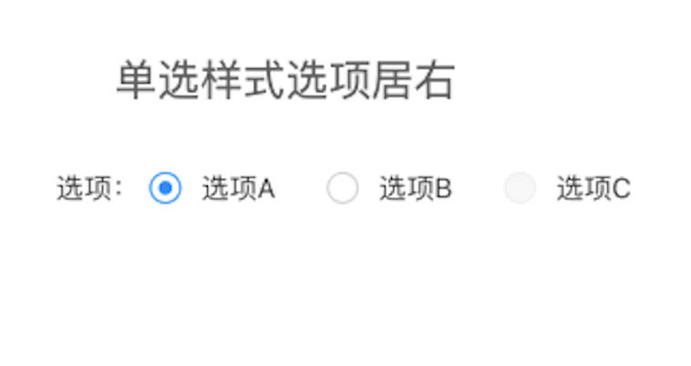
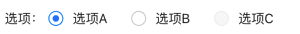

# BrnRadioButton

单项选择

## 一、效果总览



## 二、描述

### 适用场景

可用于组合单选的选择视图。

### 交互规则

1. 支持除了 icon 部分视图的自定义。
3. 传入自定义 widget 时，widget 和 icon 使用 Row 包裹，支持传入 Row 的属性 MainAxisAlignment 和MainAxisSize，进行配置。

## 三、构造函数及参数说明

### 构造函数

```dart
const BrnRadioButton(
    {Key? key,
    required this.radioIndex,
    required this.onValueChangedAtIndex,
    this.disable = false,
    this.isSelected = false,
    this.iconPadding,
    this.child,
    this.childOnRight = true,
    this.mainAxisAlignment = MainAxisAlignment.start,
    this.crossAxisAlignment = CrossAxisAlignment.center,
    this.mainAxisSize = MainAxisSize.min,
    this.behavior = HitTestBehavior.translucent});
```
### 参数说明

| **参数名** | **参数类型** | **描述** | **是否必填** | **默认值** |
| --- | --- | --- | --- | --- |
| radioIndex | Int | 标识当前Radio的Index | 是 | 无 |
| onValueChangedAtIndex | void Function(int, bool) | radio选中状态发生变化产生的回调，int 为 选项的index，bool 为选项的选中状态，true表示选中，false未选中 | 是 | 无 |
| isSelected | bool | 初始选中状态 | 否 | false |
| disable | bool | 选项是否禁用 | 否 | false |
| child | widget? | 除了 icon 部分的自定义视图 | 否 | 无 |
| iconPadding | EdgeInsets? | 选择图标的padding | 否 | EdgeInsets.all(5) |
| childOnRight | bool | widget在是否在选择 icon 的右边，false 就在左边 | 否 | true |
| mainAxisAlignment | MainAxisAlignment | child 视图和 icon 在row布局里面的alignment | 否 | MainAxisAlignment.start |
| crossAxisAlignment | CrossAxisAlignment | child 视图和 icon 在row布局里面的CrossAlignment | 否 | CrossAxisAlignment.center |
| mainAxisSize | MainAxisSize | child 视图和 icon 在row布局里面的mainAxisSize | 否 | MainAxisSize.min |
| behavior | HitTestBehavior | 默认值HitTestBehavior.translucent，控制widget.onRadioItemClick触发的点击范围 | 否 | HitTestBehavior.translucent |

## 四、代码演示

### 效果1：单选+选项居左+不可用状态



```dart
Row(
  children: <Widget>[
    SizedBox(
      width: 5,
    ),
    Text("选项："),
    BrnRadioButton(
      radioIndex: 0,
      isSelected: _singleSelectedIndex == 0,
      child: Padding(
        padding: EdgeInsets.only(left: 5),
        child: Text(
          "选项A",
        ),
      ),
      onValueChangedAtIndex: (index, value) {
        setState(() {
          _singleSelectedIndex = index;
          BrnToast.show("单选，选中第$index个", context);
        });
      },
    ),
    SizedBox(
      width: 20,
    ),
    BrnRadioButton(
      radioIndex: 1,
      isSelected: _singleSelectedIndex == 1,
      child: Padding(
        padding: EdgeInsets.only(left: 5),
        child: Text(
          "选项B",
        ),
      ),
      onValueChangedAtIndex: (index, value) {
        setState(() {
          _singleSelectedIndex = index;
          BrnToast.show("单选，选中第$index个", context);
        });
      },
    ),
    SizedBox(
      width: 20,
    ),
    BrnRadioButton(
      radioIndex: 1,
      disable: true,
      isSelected: _singleSelectedIndex == 1,
      child: Padding(
        padding: EdgeInsets.only(left: 5),
        child: Text(
          "选项C",
        ),
      ),
      onValueChangedAtIndex: (index, value) {
        setState(() {
          _singleSelectedIndex = index;
          BrnToast.show("单选，选中第$index个", context);
        });
      },
    ),
  ],
)
```
### 效果2：自定义视图


```dart
BrnRadioButton(
  radioType: BrnRadioType.multi,
  radioIndex: 10,
  isSelected: true,
  childOnRight: true,
  mainAxisSize: MainAxisSize.max,
  child: Container(
      width: 100,
      height: 20,
      color: Colors.lightBlue,
      child: Center(
          child: Text('自定义视图',
              style: TextStyle(color: Colors.white)))),
  onValueChangedAtIndex: (index, value) {
    if (value) {
      BrnToast.show("第$index项被选中", context);
    } else {
      BrnToast.show("第$index项取消选中", context);
    }
  },
),
```
