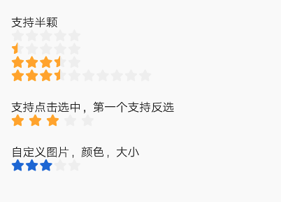
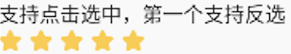
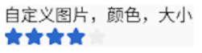

# BrnRatingStar

星级评分条

## 一、效果总览



## 二、描述

### 适用场景

星级评分条RatingBar支持自定义图片，颜色，大小，间距，支持点击选中，支持第一个反选，支持半颗星（只用于展示，不支持选择半颗星）。

## 三、构造函数及参数说明

### 构造函数

```dart
const BrnRatingStar({
  Key? key,
  this.count = DEFAULT_COUNT,
  this.selectedCount = 0,
  this.space = DEFAULT_SPACE,
  this.starBuilder,
  this.onSelected,
  this.canRatingZero = false,
}) : super(key: key);
```
### 参数说明

| **参数名** | **参数类型** | **描述** | **是否必填** | **默认值** |
| --- | --- | --- | --- | --- |
| count | int | 星星总数 | 否 | 5 |
| selectedCount | int | 初始选中的个数 | 否 | 0 |
| space | double | 星星间距 | 否 | 1.0 |
| onSelected | `ValueChanged<int>?` | 点击回调，设置了才能支持点击选中操作 | 否 |  |
| canRatingZero | bool | 是否可评 0 颗星，即第一颗星是否支持反选，默认不可评 0 星 | 否 | false |
| starBuilder | BrnRatingStarBuilder? | 单颗星星视图的自定义构造器 | 否 |  |

## 四、代码演示

### 效果1


```dart
BrnRatingBar(),
```
### 效果2


```dart
BrnRatingBar(  
  selectedCount: 0.5,  
)  
BrnRatingBar(  
  selectedCount: 3.1,  
),  
BrnRatingBar(  
  selectedCount: 3.6,  
  count: 10,  
),  
```
### 效果3



```dart
GestureDetector(
  child: Text("支持点击选中，第一个支持反选"),
  onTap: () {
    Toast.show("haha", context);
    setState(() {
      num = 4;
    });
  },
)
```

```dart
 BrnRatingStar(
  selectedCount: num.toDouble(),
  space: 5,
  canRatingZero: true,
  onSelected: (count) {
    Toast.show("选中了$count个", context);
  },
)
```
### 效果4



```dart
BrnRatingStar(
  selectedCount: 3,
  space: 1,
  canRatingZero: true,
  onSelected: (count) {
    Toast.show("选中了$count个", context);
  },
  starBuilder: _buildRating,
)
```

```dart
Widget _buildRating(RatingState state) {
  switch (state) {
    case RatingState.select:
      return BrunoTools.getAssetSizeImage(BrnAsset.ICON_STAR, 16, 16, color: Color(0xFF3571DC));
    case RatingState.half:
      return BrunoTools.getAssetSizeImage(BrnAsset.ICON_STAR_HALF, 16, 16);
    case RatingState.unselect:
    default:
      return BrunoTools.getAssetSizeImage(BrnAsset.ICON_STAR, 16, 16, color: Color(0xFFF0F0F0));
  }
}
```
