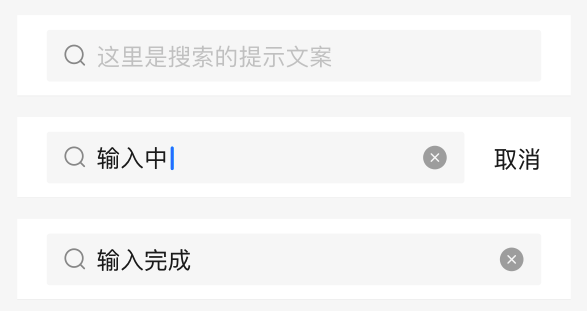

# BrnSearchText

搜索框，用于输入文本进行搜索。

## 一、效果总览




## 二、描述

### 使用场景

通用的搜索框。
1. Appbar 为搜索框的情况；
2. 页面顶部存在搜索的情况；
3. 或 页面内存在搜索的情况。

### 交互规则
1. 获得焦点的时候取消会展示，默认不展示。
2. 当有文字的时候，删除按钮可展示，删除按钮的点击事件为清空输入项。


## 三、构造函数及参数说明

### 构造函数


```dart
const BrnSearchText({
  Key? key,
  this.searchController,
  this.controller,
  this.maxLines = 1,
  this.maxLength,
  this.hintText,
  this.hintStyle,
  this.textStyle,
  this.prefixIcon,
  this.onTextChange,
  this.onTextCommit,
  this.onTextClear,
  this.onActionTap,
  this.action,
  this.maxHeight = 60,
  this.innerPadding =
      const EdgeInsets.only(top: 10, bottom: 10, left: 20, right: 20),
  this.outSideColor = Colors.white,
  this.innerColor = const Color(0xfff8f8f8),
  this.normalBorder,
  this.activeBorder,
  this.borderRadius = const BorderRadius.all(const Radius.circular(6.0)),
  this.focusNode,
  this.autoFocus = false,
  this.textInputAction,
}) : super(key: key);
```


### 参数说明

| **参数名** | **参数类型** | **作用** | **是否必填** | **默认值** |
| --- | --- | --- | --- | --- |
| searchController | BrnSearchTextController? | 用于控制 clear Icon 和右侧 Action 的显示与隐藏。等其他复杂的操作。 | 否 | 无 |
| controller | TextEditingController? | 控制输入框行为和相应监听 | 否 | 无 |
| maxLines | int | 允许输入的最大行数 | 否 | 1 |
| maxLength | int? | 允许输入的最大长度 | 否 | 无 |
| hintText | String? | 输入提示语,默认为"请输入搜索内容" | 否 | "请输入搜索内容" |
| hintStyle | TextStyle? | 输入提示语的样式 | 否 | TextStyle(fontSize: 16,height: 1, textBaseline: TextBaseline.alphabetic,color: Color(0xff999999),) |
| textStyle | TextStyle? | 输入文本的样式 | 否 | TextStyle(textBaseline: TextBaseline.alphabetic,color: BrunoColor.instance.F0Color, fontSize: 16) |
| prefixIcon | Widget? | 输入框前置的图标 | 否 | 默认为搜索图标 |
| onTextChange | `BrnOnSearchTextChange=void Function(String content)?` | 搜索框输入内容改变时候的回调函数,str为输入内容 | 否 | 无 |
| onTextCommit | `BrnOnCommit=void Function(String content)?` | 输入内容点击搜索后的回调，content为输入内容 | 否 | 无 |
| onTextClear | `BrnOnTextClear = bool Function()?` | 拦截取消的事件。<br />1、返回值为true，表明用户想要拦截，则不会走默认的清除行为<br />2、如果返回值为false，表明用户不想要拦截，在执行了用户的行为之后，还会走默认的行为 | 否 | 无 |
| onActionTap | VoidCallback? | 右侧 action 区域点击的回调 | 否 | 无 |
| action | widget? | 右侧操作 widget | 否 | 无 |
| maxHeight | double | 搜索框的最大高 | 否 |  60 |
| innerPadding | EdgeInsets | 文本内容与边框的边距，设置该字段会导致显示区域变小。 | 否 | EdgeInsets.only(top: 10, bottom: 10, left: 20, right: 20) |
| outSideColor | Color | 包裹搜索框的容器背景色 | 否 | 白色 |
| innerColor | Color | 搜索框内部的颜色 | 否 | Color(0xfff8f8f8) |
| normalBorder | BoxBorder? | 一般状态边框 | 否 | Border.all(width: 1.0, color: widget.innerColor) |
| activeBorder | BoxBorder? | 激活状态边框 | 否 | Border.all(width: 1.0, color: widget.innerColor) |
| borderRadius | BorderRadius | 边框圆角 | 否 | BorderRadius.all(const Radius.circular(6.0)) |
| focusNode | FocusNode? | 管理焦点 | 否 | 无 |
| autofocus | bool | 是否自动获取焦点 | 否 | false |
| textInputAction | TextInputAction? | 用于控制键盘动作 | 否 | 无 |


## 四、代码演示

### 效果1: 点击取消失去焦点
只有点击清除 icon 才会清除内容

 
```dart
BrnSearchTextController searchController = BrnSearchTextController();  
TextEditingController textController = TextEditingController();  

///initState 中添加监听，记得销毁
textController.addListener((){  
  if(focusNode.hasFocus){  
    if(!isEmpty(textController.text)) {  
      searchController.isClearShow = true;  
      searchController.isActionShow = true;  
    }  
  }  
});  
focusNode.addListener((){  
  if(focusNode.hasFocus){  
    if(!isEmpty(textController.text)) {  
      searchController.isClearShow = true;  
    }  
  }  
});  
BrnSearchText(
  focusNode: focusNode,
  controller: textController,
  searchController: scontroller..isActionShow = true,
  onTextClear: () {
    return false;
  },
  autoFocus: true,
  onActionTap: () {
    scontroller.isClearShow = false;
    scontroller.isActionShow = false;
    focusNode.unfocus();
    BrnToast.show('取消', context);
  },
  onTextCommit: (text) {
    BrnToast.show('提交内容 : $text', context);
  },
  onTextChange: (text) {
    BrnToast.show('输入内容 : $text', context);
  },
)
```


### 效果2: 自定义Search 的边框颜色

 

```dart
Container(
  width: 200,
  child: BrnSearchText(
    innerPadding: EdgeInsets.only(left: 20, right: 20, top: 10, bottom: 10),
    maxHeight: 60,
    innerColor: Colors.white,
    borderRadius: BorderRadius.all(Radius.circular(10)),
    normalBorder:
        Border.all(color: Color(0xFFF0F0F0), width: 1, style: BorderStyle.solid),
    activeBorder:
        Border.all(color: Color(0xFF0984F9), width: 1, style: BorderStyle.solid),
    onTextClear: () {
      focusNode.unfocus();
      return false;
    },
    autoFocus: true,
    action: Container(),
    onActionTap: () {
      BrnToast.show('取消', context);
    },
    onTextCommit: (text) {
      BrnToast.show('提交内容 : $text', context);
    },
    onTextChange: (text) {
      BrnToast.show('输入内容 : $text', context);
    },
  ),
)
```
