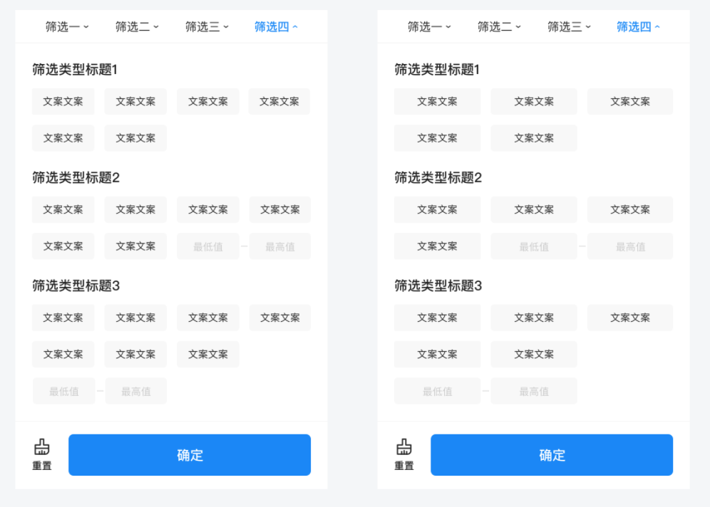
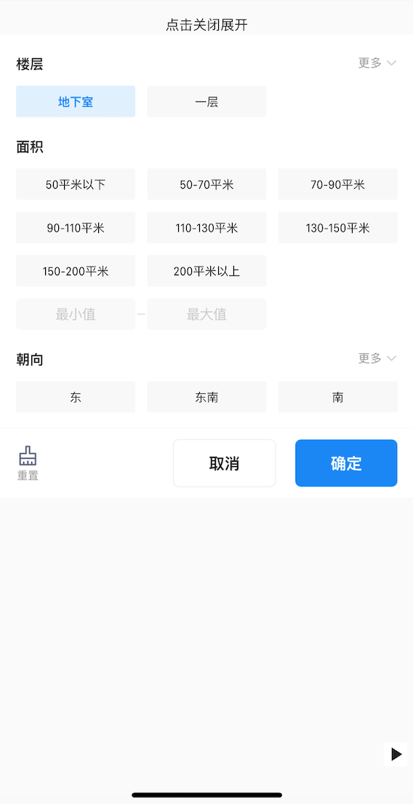
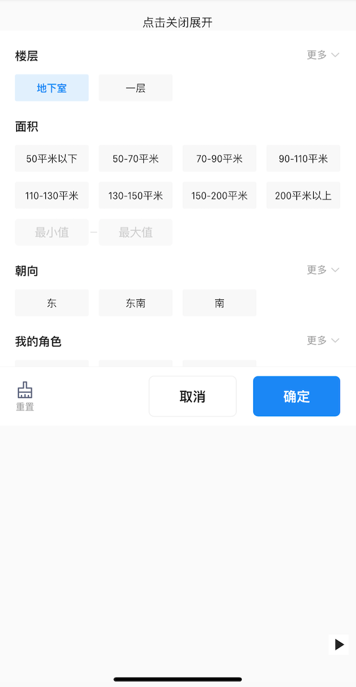

# BrnFlatSelection

区间+输入混合一级筛选。

## 一、效果总览




## 二、描述

### 适用场景

一级平铺筛选，目前应用pad上。

## 三、构造函数及参数说明

### 构造函数


```dart
BrnFlatSelection(
  {Key? key,
  this.entityDataList,
  this.confirmCallback,
  this.onCustomFloatingLayerClick,
  this.preLineTagSize = 3,
  this.isNeedConfigChild = true,
  this.controller,
  this.themeData}) {
  this.themeData ??= BrnSelectionConfig();
  this.themeData = BrnThemeConfigurator.instance
    .getConfig(configId: themeData.configId)
    .selectionConfig
    .merge(themeData);
}
```


### 参数说明

| 参数名 | 参数类型 | 描述 | 是否必填 | 默认值 |
| --- | --- | --- | --- | --- |
| entityDataList | `List<BrnSelectionEntity>` | 筛选原始数据 | 是 | 无 |
| confirmCallback | `Function(Map<String, String>)?` | 确定回调 | 否 | 无 |
| preLineTagSize | int | 每行展示tag数 | 是 | 3 |
| onCustomFloatingLayerClick | BrnOnCustomFloatingLayerClick? | 自定义事件处理 | 否 | 无 |
| isNeedConfigChild | bool | 是否需要配置子选项 | 是 | true |
| controller | BrnFlatSelectionController? | 自定义controller | 否 | 无 |
| themeData | BrnSelectionConfig? | 筛选项主题配置，配置详见BrnSelectionConfig | 否 | |

## 四、代码演示

### 效果1



```dart
BrnFlatSelection(  
  entityDataList: widget._filterData,  
  confirmCallback: (data) {  
    String str = '';  
    data.forEach((k, v) => str=str +" "+'${k}: ${v}');  
    BrnToast.show(str, context);  
  },  
  controller: controller)
```
### 效果2



```dart
BrnFlatSelection(  
  preLineTagSize: 4,  
  entityDataList: widget._filterData,  
  confirmCallback: (data) {  
    String str = '';  
    data.forEach((k, v) => str=str +" "+'${k}: ${v}');  
    BrnToast.show(str, context);  
  },  
  controller: controller)
```

