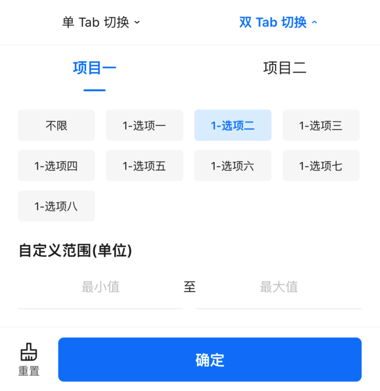

# BrnSelectionView

用于筛选数据

相关组件 [BrnFlatSelectionWidget](../widgets/brn-flat-selection)

相关组件 [BrnSimpleSelection](../widgets/brn-simple-selection)

## 一、效果总览


## 二、组件描述

### 适用场景

筛选组件包括下面几种类型，可用在多种场景：

- 列表筛选型，单列表筛选、双列表筛选、三列表筛选
- 标签筛选型，无 Tab 标签类型、多 Tab 标签类型
- 时间筛选型，时间点选择，时间范围选择类型

### 交互规则

- 筛选数据交互分为单选（时间点）、多选（时间范围）两种方式
- 在两列、三列、多 Tab 情况下，当同一层级同时配置了单选类型选项（ radio） 和多选类型选项（ checkbox）的筛选项时：

  1. 当选中了单选（radio）类型的选项时，会将**同一级别的其他筛选项**，以及**他们的子选项**状态置为**未选中**。
  2. 当选中了多选（checkbox）类型的选项时，会将**同一级别的单选类型筛选项（radio）**， 以及**他们的子筛选项**状态置为**未选中**。
  3. 当选中不限（UnLimit）类型的选项时，会将**同一级别的其它筛选项**、以及同级别的子筛选项状态都会置为**未选中**。

### 注意事项

- 如果需要异步请求筛选数据或组装筛选数据 Entity，刷新筛选组件数据，需要在根结点 entity 中做 configChild() 操作；

- 如果需要在回调中变更 entity 对应的筛选项数据，需要调用 entity.configChild() 方法。来重新构建筛选结点树。 例如：ConfigRowCountFunction、BrnCustomSelectionActionHandle、JoinTitleActionHandle、BrnOnWindowPreShow 等回调方法。

- 最顶层的筛选节点 type 需要有类型（单选 radio、多选 checkbox），不能为空

- 数据结构中的 key 字段必须设置，如果结点中没有 key 。

- 筛选数据各结构中，所有筛选项的【 key】 对应的 value 值从其子筛选中获取，如下图所示，最终获取的筛选参数是

  ```json
  {
    "two_list_key": "1",
    "first_list_key": "1-2"
  }
  ```


- 筛选数据的结构为一个树结构

  

## 三、构造函数及参数配置

```dart
BrnSelectionView(
  {Key key,
  this.originalSelectionData,
  @required this.onSelectionChanged,
  this.selectionViewController,
  this.configRowCount,
  this.selectionConverterDelegate = defaultConverter,
  this.onMenuClickInterceptor,
  this.onCustomSelectionMenuClick,
  this.onCustomFloatingLayerClick,
  this.onMoreSelectionMenuClick,
  this.onDefaultParamsPrepared,
  this.onSelectionPreShow,
  this.constantTop,
  this.extraScrollController,
  this.themeData})
```

### 参数说明

| **参数名**                 | **参数类型**                                                 | **作用**                                                     | **是否必填** | **默认值** |
| -------------------------- | ------------------------------------------------------------ | ------------------------------------------------------------ | ------------ | ---------- |
| originalSelectionData      | `List<**BrnSelectionEntity**>`                                 | 筛选所需数据用于展示筛选菜单栏，以及展开的筛选弹窗。         | 是           | 空         |
| selectionViewController    | BrnSelectionViewController?                                  | 用于主动控制筛选弹窗的关闭和刷新菜单的内容状态               | 否           |            |
| onSelectionChanged         | `void Function(int menuIndex, Map<String, String> selectedParams, Map<String, String> customParams, BrnSetCustomSelectionMenuTitle setCustomMenuTitle)` | 点击筛选弹窗中的【确认】按钮时回调给外部选中的参数,包括:<br />menuIndex：当前展开的 menu 位置;<br />selectedParams 所有筛选弹窗中选中的参数；<br />customParams：拦截 CustomHandle 类型的筛选并设置的自定义参数；setCustomMenuTitle：对当前的筛选 Menu 设置 title 和高亮的回调函数，一般与 customParams 、**onCustomSelectionMenuClick**搭配使用，例如，通过 onCustomSelectionMenuClick 回调返回 customParams 参数，setCustomMenuTitle 根据 customParams 参数判断是否高亮，是否需要根据参数更新筛选菜单的 Title。 | 是           |            |
| configRowCount             | `BrnConfigTagCountPerRow(int index, BrnSelectionEntity entity)?` | 仅适用于类型为 SelectionWindowType.Range 的筛选弹窗，用于对 SelectionWindowType.Range 类型的列数做配置，回调参数为 menu 的所在位置 index 和 menu 的数据。 | 否           | 空         |
| selectionConverterDelegate | DefaultSelectionConverter                                    | 用于对处理 originalSelectionData 筛选数据，返回选中的参数。返回选中的参数返回类型为 Map<String, String>。 | 是           |            |
| onCustomSelectionMenuClick | `Function(int index, BrnSelectionEntity customMenuItem, BrnSetCustomSelectionParams customSelectionParams)?` | 自定义（CustomHandle）类型的 menu 被点击的回调。<br />int index: 自定义 menu 所在位置 BrnSelectionEntity customMenuItem 自定义 menu 的数据<br />customSelectionParams：设置自定义参数 | 否           |            |
| onCustomFloatingLayerClick | `Function(int index, BrnSelectionEntity customFloatingLayerEntity, BrnSetCustomFloatingLayerSelectionParams setCustomFloatingLayerSelectionParams)?` | 用于【**更多-筛选**】中自定义二级浮层的点击回调（自定义二级浮层类型为 customfloatinglayer） | 否           |            |
| onMoreSelectionMenuClick   | `void Function(int index, BrnOpenMorePage openMorePage)?`    | 点击【更多】筛选项时的回调。<br />index 为点击的位置<br />openMorePage：让用户触发的回调，用于展开更多筛选页面。`OpenMorePage = void Function({bool updateData, List moreSelections});` | 否           |            |
| onDefaultParamsPrepared    | `void Function(Map<String, String> selectedParams)?`         | 数据初始化完成之后返回默认选中参数的回调，在 BrnSelectioinViewState **initState** 中回触发回调<br />Map<String, String> selectedParams: 所有筛选菜单中的默认选中参数 | 否           |            |
| onSelectionPreShow         | `SelectionWindowType?` </br>`SelectionWindowType Function(int index, BrnSelectionEntity entity);` | 筛选弹窗打开前的回调方法, 并返回 SelectionWindowType 指定展示类型，是 Range 类型还是 List 类型。调用时机早于 onMenuItemClick<br />int index:点击筛选菜单的位置。<br />BrnSelectionEntity entity: index 菜单位置的筛选数据。 | 否           |            |
| onMenuClickInterceptor     | `bool Function(int index)?`                                  | 筛选菜单被点击时的回调函数，<br />返回 true 拦截 menu 点击事件<br />返回 false 不拦截<br />int index:被点击的菜单栏位置 | 否           |            |
| constantTop                | double?                                                      | 指定筛选弹窗相对于屏幕的顶部距离，默认 null 不指定位置，依附于筛选菜单组件下方。 | 否           |            |
| extraScrollController      | ScrollController?                                            | 如需要在滚动视图中监听滚动状态并隐藏筛选弹窗，可以设置要监听的 ScrollController，当监听到滚动时筛选弹窗消失。 | 否           |            |

### 其它数据结构

#### 筛选类型

```dart
enum BrnSelectionFilterType {
  /// 未设置
  none,

  /// 不限类型
  unLimit,

  /// 单选列表、单选项 type 为 radio
  radio,

  /// 多选列表、多选项 type 为 checkbox
  checkbox,

  /// 一般的值范围自定义区间 type 为 range
  range,

  /// 日期选择,普通筛选时使用 CalendarView 展示选择时间，更多情况下使用 DatePicker 选择时间
  date,

  /// 自定义选择日期区间， type 为 dateRange
  dateRange,

  /// 自定义通过 Calendar 选择日期区间，type 为 dateRangeCalendar
  dateRangeCalendar,

  /// 标签筛选 type 为 customerTag
  customHandle,

  /// 更多列表、多选项 无 type
  more,

  /// 去二级页面
  layer,

  /// 去自定义二级页面
  customLayer,
}
```

#### 筛选类型说明

| 筛选项类型        | 对应 Entity type 下发值 | 说明                                                                                                                   |
| ----------------- | ----------------------- | ---------------------------------------------------------------------------------------------------------------------- |
| None              | 无                      | 未设置 type 数据时的值。                                                                                               |
| UnLimit           | umlimit                 | “不限”类型，它与兄弟结点选中状态互斥。                                                                                 |
| Radio             | radio                   | 单选，此类型与其他类型选中状态互斥。若 radio 类型的结点                                                                |
| Checkbox          | checkbox                | 多选，此类型与非 CheckBox 类型选中状态互斥。                                                                           |
| Range             | range                   | 一般值范围选择（如居室、价格、㎡ 等），与其他类型选中状态互斥。                                                        |
| Date              | date                    | 日期时间点单选，与其他类型选中状态互斥。在一般筛选中以日历视图展示选择时间。在更多筛选页中以 DatePicker 展示选择时间。 |
| DateRange         | daterange               | 日期范围选择，与其他类型选中状态互斥。以 DatePicker 展示选择时间。                                                     |
| DateRangeCalendar | daterangecalendar       | 日期范围选择，与其他类型选中状态互斥。以 日历视图展示选择时间。                                                        |
| CustomHandle      | customhandle            | 自定义类型，用于标识筛选菜单自定义的情况，【一般其 children 不包含数据】。                                             |
| More              | more                    | 更多筛选类型，用于标识筛选菜单点击之后跳转到更多筛选页的情况。                                                         |
| Layer             | floatinglayer           | 更多筛选页子页面类型，用于标识更多筛选页的二级页面，点击之后跳转到更多筛选的二级页面。                                 |
| CustomLayer       | customfloatinglayer     | 去自定义二级页面                                                                                                       |

#### 筛选弹窗展示风格

```dart
enum SelectionWindowType {
  list,  //列表类型筛选弹窗，使用列表展示。
  range, //标签类型筛选弹窗，使用 Tag + Range 的方式展示
}
```

#### 筛选 Entity：

```dart
class BrnSelectionEntity {

  /// 类型 是单选、复选还是有自定义输入
  String type;

  /// 回传给服务器的 key
  String key;

  /// 回传给服务器的 value
  String value;

  /// 默认值
  String defaultValue;

  /// 显示的文案
  String title;

  /// 显示的文案
  String subTitle;

  /// 单位。例如居室、万，适配自定义区间填写的内容
  String unit;

  /// 扩展字段，目前只有min和max
  Map extMap;

  /// 子筛选项
  List<BrnSelectionEntity> children;

  //////////// 以上为接口下发的原始数据字段 ///////////////

  //////////// 下方为组件另需要使用的字段 ///////////////
  /// 是否选中
  bool isSelected;

  /// 自定义输入
  Map<String, String> customMap;

  /// 用于临时存储原有自定义字段数据，在筛选数据变化后未点击【确定】按钮时还原。
  Map originalCustomMap;

  /// 最大可选数量
  int maxSelectedCount;

  /// 父级筛选项
  BrnSelectionEntity parent;

  /// 筛选类型，具体参见 [BrnSelectionFilterType]
  BrnSelectionFilterType filterType;

  /// 筛选弹窗展示风格对应的首字母小写的字符串，例如 `range`、`list`，参见 [BrnSelectionWindowType]
  String showType;

  /// 筛选弹窗展示风格，具体参见 [BrnSelectionWindowType]
  BrnSelectionWindowType filterShowType;

  /// 自定义标题
  String customTitle;

  ///自定义筛选的 title
  bool isCustomTitleHighLight;

  /// 临时字段用于判断是否要将筛选项 [name] 字段拼接展示
  bool canJoinTitle = false;
}
```

### 更多筛选页面

BrnMoreSelectionPage，一般由 BrnSelectionView 的 onMoreSelectionMenuClick 触发跳转


```dart
BrnMoreSelectionPage(
  {this.entityData,
  this.confirmCallback,
  this.onCustomFloatingLayerClick,
  this.themeData});
```

| 参数名                     | 说明                                                                                   | 是否必填 |
| -------------------------- | -------------------------------------------------------------------------------------- | -------- |
| entityData                 | 更多累心的筛选（more 类型）                                                            | 是       |
| confirmCallback            | 更多筛选页面点击【确定】时的回调                                                       | 否       |
| onCustomFloatingLayerClick | 自定义浮层类型（customfloatinglayer 类型）点击时的回调，一般用于自定义二级浮层跳转页面 | 否       |

### 更多筛选二级浮层页面

BrnLayerMoreSelectionPage，一般由 BrnMoreSelectionPage 触发跳转


```dart
BrnLayerMoreSelectionPage({this.entityData, this.themeData});
```

| 参数名     | 说明                                   | 是否必填 |
| ---------- | -------------------------------------- | -------- |
| entityData | 二级浮层筛选数据（floatinglayer 类型） | 是       |

## 四、效果及代码展示

### 效果 1: 普通筛选弹窗-List 类型

[示例数据 multi_list_filter.json](https://bruno.ke.com/widgets/selection/brn-selection-view/multi_list_filter.json)


```dart
BrnSelectionView(
  originalSelectionData: widget._filterData,
  onSelectionChanged: (int menuIndex,
      Map<String, String> filterParams,
      Map<String, String> customParams,
      BrnSetCustomSelectionMenuTitle setCustomTitleFunction) {
    BrnToast.show(filterParams.toString(), context);
  }
)
```

### 效果 2: 普通筛选弹窗-Range 类型

[示例数据 multi_range_filter.json](https://bruno.ke.com/widgets/selection/brn-selection-view/multi_range_filter.json)



```dart
BrnSelectionView(
  originalSelectionData: widget._filters,
  onSelectionChanged: (int menuIndex,
      Map<String, String> filterParams,
      Map<String, String> customParams,
      BrnSetCustomSelectionMenuTitle setCustomTitleFunction) {
    BrnToast.show(filterParams.toString(), context);
  },
  onSelectionPreShow: (int index, BrnSelectionEntity entity) {
    if (entity.key == "one_range_key" || entity.key == "two_range_key") {
      return BrnSelectionWindowType.Range;
    }
    return entity.filterShowType;
  },
)
```

### 效果 3: 更多筛选展示

[示例数据 more_filter.json](https://bruno.ke.com/widgets/selection/brn-selection-view/more_filter.json)

 

```dart
BrnSelectionView(
  originalSelectionData: widget._filters,
  onMoreSelectionMenuClick: (int index, BrnOpenMorePage openMore) {
  	/// 手动触发打开更多筛选页面
    openMore(updateData: false);
  },
  onSelectionChanged: (int menuIndex,
      Map<String, String> filterParams,
      Map<String, String> customParams,
      BrnSetCustomSelectionMenuTitle setCustomTitleFunction) {},
)
```

### 效果 4: 自定义筛选参数设置

[示例数据 customhandle_filter.json](https://bruno.ke.com/widgets/selection/brn-selection-view/customhandle_filter.json)


```dart
BrnSelectionView(
  originalSelectionData: widget._filters,
  onCustomSelectionMenuClick: (int index, BrnSelectionEntity customMenuItem,
      BrnSetCustomSelectionParams customHandleCallBack) {
    // ①用户操作之后，将自定义参数回传，触发 onSelectionChanged回调。
    BrnDialogManager.showConfirmDialog(context,
        cancel: '取消', confirm: '确定', message: '点击确定，回传自定义参数到筛选', confirmTap: () {
      count++;
      // ②回填自定义选中的参数，内部会触发 onSelectionChanged回调
      customHandleCallBack({"CKey": "CValue" + '$count'});
    }, cancelTap: () {});
  },
  onSelectionChanged: (int menuIndex,
      Map<String, String> filterParams,
      Map<String, String> customParams,
      BrnSetCustomSelectionMenuTitle setCustomTitleFunction) {
		if (menuIndex == 1 && setCustomTitleFunction != null) {
		  // ③手动设置对应的 menu title 和是否高亮
      setCustomTitleFunction(
          menuTitle:
              BrunoTools.isEmpty(customParams) ? "" : customParams['CKey'] ?? "",
          isMenuTitleHighLight: !BrunoTools.isEmpty(customParams['CKey']));
    }
  },
)
```

### 效果 5: 筛选日期范围选择

[示例数据 date_range_filter.json](https://bruno.ke.com/widgets/selection/brn-selection-view/date_range_filter.json)


日期单择时【筛选子 item 】使用 date 类型。

- 日期范围选择跨度大时【筛选子 item】建议使用 daterange 类型。
- 日期范围选择跨度小时【筛选子 item】建议使用 daterangecalendar 类型。

```dart
BrnSelectionView(
  selectionViewController: controller,
  originalSelectionData: widget._filterData,
  onSelectionChanged: (int menuIndex,
      Map<String, String> filterParams,
      Map<String, String> customParams,
      BrnSetCustomSelectionMenuTitle setCustomTitleFunction) {
    BrnToast.show(filterParams.toString(), context);
  },
  onSelectionPreShow: (int index, BrnSelectionEntity entity) {
    if (entity.key == 'date_11' || entity.key == 'date_22') {
      return BrnSelectionWindowType.Range;
    }
    return entity.filterShowType;
  },
)
```
