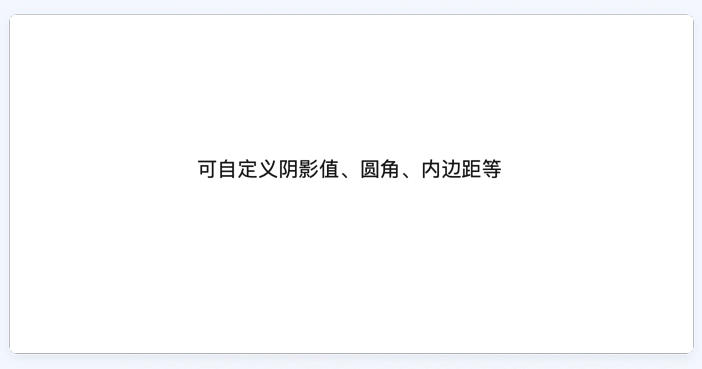

# BrnShadowCard

支持自定义边框属性阴影卡片

## 一、效果



## 二、描述

### 适用场景

业务方自定义背景的颜色，边框属性，child 子类等属性。

## 三、构造函数及参数说明

### 构造函数

```dart
BrnShadowCard(
    {required this.child,
    this.color = const Color(0xfffafafa),
    this.shadowColor = const Color(0xffeeeeee),
    this.padding = const EdgeInsets.all(0),
    this.circular = 4.0,
    this.blurRadius = 5.0,
    this.spreadRadius = 0,
    this.offset = Offset.zero,
    this.borderWidth = 0.5});
```

### 参数说明

| **参数名**   | **参数类型**       | **描述**          | **是否必填** | **默认值**        |
| ------------ | ------------------ | ----------------- | ------------ | ----------------- |
| color        | Color              | 背景色            | 否           | Color(0xfffafafa) |
| shadowColor  | Color              | 阴影颜色          | 否           | Color(0xffeeeeee) |
| offset       | Offset             | 阴影 xy 轴偏移量  | 否           | 0                 |
| padding      | EdgeInsetsGeometry | 内边距            | 否           | EdgeInsets.all(0) |
| circular     | double             | 圆角大小          | 否           | 4.0               |
| blurRadius   | double             | 阴影模糊程度      | 否           | 5.0               |
| spreadRadius | double             | 阴影扩散程度      | 否           | 0                 |
| borderWidth  | double             | 边框宽度          | 否           | 0.5               |
| child        | Widget             | 需要填充的 widget | 是           | 无                |

## 三、代码演示

### 效果 1


```dart
BrnShadowCard(
  padding: EdgeInsets.all(20),
  color: Colors.white,
  child: Container(
    color: Colors.blue[200],
    child: Text(
      '阴影卡片，\n这是内容区域',
      style: TextStyle(fontSize: 26),
    ),
  ),
);
```
