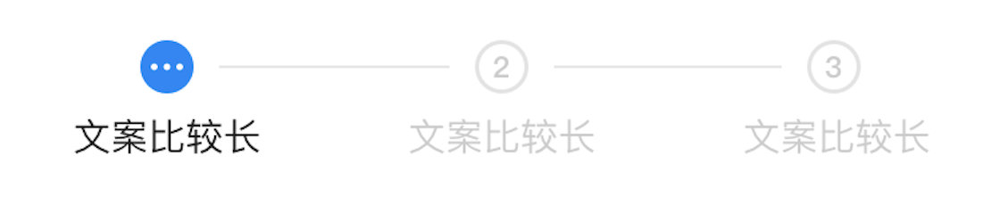
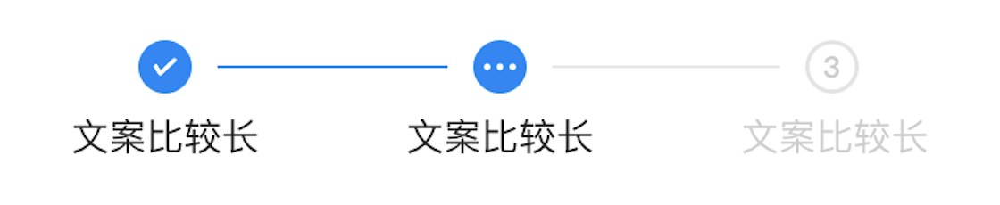
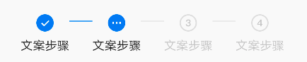

# BrnHorizontalSteps


横向步骤条一种常见的导航形式

## 一、效果总览



## 二、描述

### 适用场景

1.横向步骤条是一种常见的导航形式，它具有导航通用的属性：告知用户”我在哪/我能去哪“，步骤数目就相当于告知用户--能去哪或者说流程将要经历什么。

### 交互规则

1.通用组件步骤条分为三个状态：完成态/进行态/等待态，三种状态在样式上均加以区分

### **注意事项**

1.横向步骤条内的步骤总数最多只支持5个。

## 三、构造函数及参数说明

### 构造函数

```dart
const BrnHorizontalSteps({
    Key? key,
    required this.steps,
    this.controller,
    this.doingIcon,
    this.completedIcon,
  })  : assert(steps.length < 6),
        super(key: key);
```

### 参数说明

#### BrnStepsController 方法说明

| **方法名** | **参数** | **描述** |
| --- | --- | --- |
| buildSteps | steps、currentIndex、isCompleted、doingIcon、completedIcon | 创建步骤条 |
| forwardStep | 无 | 向前一步 |
| backStep | 无 | 向后一步 |
| setCurrentIndex | index | 设置步骤条当前活跃的index |
| setIsCompleted | isCompleted | 设置整个流程是否完成 |

#### buildSteps方法参数说明

| **参数名** | **参数类型** | **描述** | **是否必填** | **默认值** |
| --- | --- | --- | --- | --- |
| steps | `List<BrunoStep>` 注：BrunoStep见下说明 | 步骤条中元素的列表 | 是，最多支持 5 个 |  |
| currentIndex | int | 指示当前进行态的步骤 | 是 |  |
| isCompleted | bool | 整个流程是否完成 | 否 |  |
| doingIcon | Widget | 自定义正在进行状态的icon | 否 |  |
| completedIcon | Widget | 自定义已完成状态的icon | 否 |  |

#### BrunoStep参数说明

| 参数名称 | 参数类型 | 描述 |
| --- | --- | --- |
| stepContentText | String? | 步骤显示的文案 |
| stepContent | Widget? | 步骤自定义视图，如果stepContentText同时存在，此属性优先级更高 |
| doingIcon | Widget? | 步骤正在进行时的图标自定义视图 |
| completedIcon | Widget? | 步骤完成时的图标自定义视图 |
| state | BrunoStepState? | indexed/doing/complete未进行/正在进行/已完成 |

## 四、代码演示

### 效果1




```dart
 int _index;
  BrnHorizontalStepsManager _stepsManager = BrnHorizontalStepsManager();

  @override
  void initState() {
    _index = 1;
    super.initState();
  }

  @override
  Widget build(BuildContext context) {
    return Scaffold(
        appBar: BrnAppBar(
          title: widget.title,
          actions: controlSteps(context),
        ),
        body: _stepsManager.buildSteps(currentIndex: _index, isCompleted: false, steps: <BrunoStep>[
          BrunoStep(
            stepContentText: "文案步骤",
          ),
          BrunoStep(
            stepContentText: "文案步骤",
          ),
          BrunoStep(
            stepContentText: "文案步骤",
          ),
          BrunoStep(
            stepContentText: "文案步骤",
          ),
        ]));
  }

  List<Widget> controlSteps(BuildContext context) {
    List<Widget> result = List<Widget>();

    result.add(BrnTextAction("上一步", iconPressed: () {
      _stepsManager.backStep();
    }));

    result.add(BrnTextAction("下一步", iconPressed: () {
      _stepsManager.forwardStep();
    }));
    return result;
  }
```
