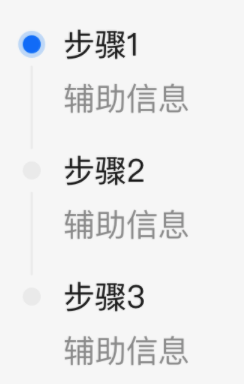
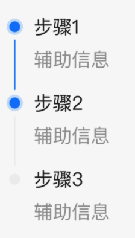
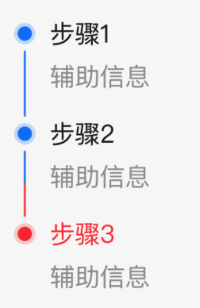
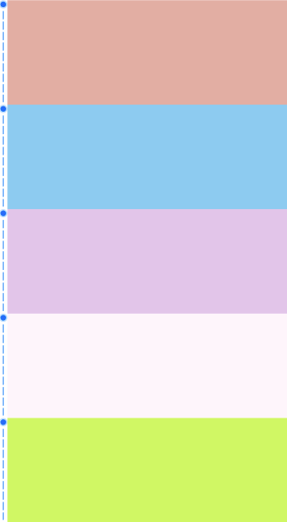

# BrnStepLine

垂直步骤条

## 一、效果总览



## 二、组件说明

### 适用场景

1. 适用于分部展示

2. 适用于时间线的情况

### 交互规则

1. 该元件提供了一个垂直步骤的边框，使用时需要填充右侧的 widget

2. 支持虚线展示

## 三、构造函数及参数说明

### 构造函数

```dart
const BrnStepLine({
  Key? key,
  required this.contentWidget,
  this.isGrey = false,
  this.lineColor,
  this.lineWidth = 2,
  this.iconTopPadding = 0,
  this.isDashLine = false,
  this.dashLength = 4,
  this.dashSpace = 4,
  this.contentLeftPadding = 12,
  this.normalColor,
  this.highlightColor,
  this.iconWidget,
}) : super(key: key);
```

### 参数说明

| **参数名**         | **参数类型** | **描述**                                                     | **是否必填** | **默认值**        |
| ------------------ | ------------ | ------------------------------------------------------------ | ------------ | ----------------- |
| contentWidget      | Widget       | 右侧显示的 widget                                            | 是           | 无                |
| isGrey             | bool         | 是否整体是灰色：线条和 Icon                                  | 否           | false             |
| lineColor          | dynamic      | Color 或者 `List<Color>`,边框线的颜色，如果是数组则分段展示线条 | 否           | 主题色            |
| lineWidth          | double       | 线的宽度                                                     | 否           | 2                 |
| iconTopPadding     | double       | icon 距离所在 Item 项顶部的 padding                          | 否           | 0                 |
| isDashLine         | bool         | 是否是虚线模式                                               | 否           | false             |
| dashLength         | double       | 小虚线短的长度                                               | 否           | 4                 |
| dashSpace          | double       | 小虚线段之间的间隔                                           | 否           | 4                 |
| contentLeftPadding | double       | contentWidget 距离左侧的 padding                             | 否           | 12                |
| normalColor        | Color?       | 普通状态(isGrey=true)的颜色                                  | 否           | Color(0xffeeeeee) |
| highlightColor     | Color?       | 高亮状态(isGrey=false)的颜色                                 | 否           | 主题色            |
| iconWidget         | Widget?      | 自定义 icon 的 widget                                        | 否           | 无                |

## 四、代码演示

### 效果 1 ：常规展示效果，第一个 Icon 为亮色

&nbsp;

```dart
ListView.builder(
  padding: EdgeInsets.only(top: 20),
  physics: NeverScrollableScrollPhysics(),
  shrinkWrap: true,
  itemCount: 3,
  itemBuilder: (context, index) {
    return BrnStepLine(
      lineWidth: 1,
      //非第一个是灰色
      isGrey: index !=0 ,
      //最后一个的线条为透明色 做到不显示的效果
  	  lineColor: Color(0xffeeeeee),
      contentWidget: Container(
        padding: EdgeInsets.only(left: 8),
        child: Column(
          crossAxisAlignment: CrossAxisAlignment.start,
          children: <Widget>[
        Text(
        '步骤${index + 1}',
          style: TextStyle(
            height: 0.9,
            color: BrnThemeConfigurator.instance.getConfig().commonConfig.colorTextBase,
            fontSize: 16,
          ),
        ),
        Padding(
            padding: const EdgeInsets.only(top: 20,bottom: 20),
        child: Text(
          '辅助信息',
          style: TextStyle(
            color: BrnThemeConfigurator.instance.getConfig().commonConfig.colorTextSecondary,
            fontSize: 14,
          ),
        ),
      )
      ],
    ),
    ),
    );
  },
)
```

### 效果 2：最后一个灰色

&nbsp;

```dart
ListView.builder(
  padding: EdgeInsets.only(top: 20),
  physics: NeverScrollableScrollPhysics(),
  shrinkWrap: true,
  itemCount: 3,
  itemBuilder: (context, index) {
    return BrnStepLine(
      lineWidth: 1,
      //最后一个是灰色
      isGrey: index == 2,
      //最后一个的线条为透明色 做到不显示的效果
      lineColor: index == 2 ? Colors.transparent : null,
      highlightColor: BrnThemeConfigurator.instance.getConfig().commonConfig.brandPrimary,
      contentWidget: Container(
        padding: EdgeInsets.only(left: 8),
        child: Column(
          crossAxisAlignment: CrossAxisAlignment.start,
          children: <Widget>[
        Text(
        '步骤${index + 1}',
          style: TextStyle(
            height: 0.9,
            color: BrnThemeConfigurator.instance.getConfig().commonConfig.colorTextBase,
            fontSize: 16,
          ),
        ),
        Padding(
            padding: const EdgeInsets.only(top: 20,bottom: 20),
        child: Text(
          '辅助信息',
          style: TextStyle(
            color: BrnThemeConfigurator.instance.getConfig().commonConfig.colorTextSecondary,
            fontSize: 14,
          ),
        ),
      )
      ],
    ),
    ),
    );
  },
),
```

### 效果三：线条颜色变化

&nbsp;

```dart
ListView.builder(
  padding: EdgeInsets.only(top: 20),
  physics: NeverScrollableScrollPhysics(),
  shrinkWrap: true,
  itemCount: 3,
  itemBuilder: (context, index) {
    return BrnStepLine(
      lineWidth: 1,
      //最后一个的线条为透明色 做到不显示的效果
      lineColor: index == 2
          ? Colors.transparent
          : (index == 1
              ? [
                  BrnThemeConfigurator.instance.getConfig().commonConfig.brandPrimary,
                  Colors.red
                ]
              : null),
      highlightColor: index == 2
          ? Colors.red
          : BrnThemeConfigurator.instance.getConfig().commonConfig.brandPrimary,
      contentWidget: Container(
        padding: EdgeInsets.only(left: 8),
        child: Column(
          crossAxisAlignment: CrossAxisAlignment.start,
          children: <Widget>[
            Text(
              '步骤${index + 1}',
              style: TextStyle(
                height: 0.9,
                color: BrnThemeConfigurator.instance
                    .getConfig()
                    .commonConfig
                    .colorTextBase,
                fontSize: 16,
              ),
            ),
            Padding(
              padding: const EdgeInsets.only(top: 20, bottom: 20),
              child: Text(
                '辅助信息',
                style: TextStyle(
                  color: BrnThemeConfigurator.instance
                      .getConfig()
                      .commonConfig
                      .colorTextSecondary,
                  fontSize: 14,
                ),
              ),
            )
          ],
        ),
      ),
    );
  },
)
```

### 效果 4：虚线模式

&nbsp;

```dart
ListView.builder(
  shrinkWrap: true,
  physics: NeverScrollableScrollPhysics(),
  itemCount: 5,
  itemBuilder: (context, index) {
    return BrnStepLine(
      lineWidth: 1,
      lineColor: <Color>[
        BrnThemeConfigurator.instance.getConfig().commonConfig.brandPrimary,
        Colors.red,
      ],
      isDashLine: true,
      dashLength: 11,
      contentWidget: Container(
        height: 150,
        color: getRandomColor(),
      ),
    );
  },
),
```
