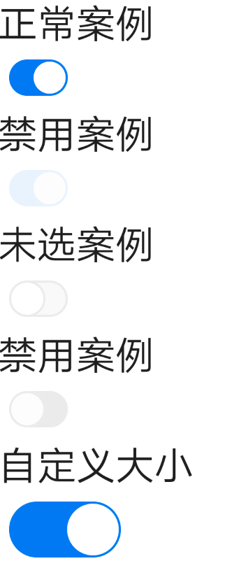

# BrnBigMainButton

## 一、效果总览



## 二、描述

### 适用场景

常用于选项开关


## 三、构造函数及参数说明

### 构造函数

```dart
 BrnSwitchButton({
    Key? key,
    required this.value,
    this.enabled = true,
    required this.onChanged,
    this.size = const Size(42, 26),
    this.borderColor,
  }) : super(key: key);
```
### 参数说明

| **参数名** | **参数类型** | 描述 | **是否必填** | **默认值** |
| --- | --- | --- | --- | --- |
| value | bool | 选中的状态 | 是 | 无 |
| enabled | bool | 是否可以交互 | 否 | true |
| onChanged | `ValueChanged<bool>` | 点击事件 | 否 | 无 |
| borderColor | Color? | 未选中时边框的颜色 | 否 | 主题色 |


## 四、代码演示

### 效果1


```dart
BrnSwitchButton(
  enabled: false,
  value: value2,
  onChanged: (value) {
    setState(() {
      value2 = value;
    });
  },
)
```


### 效果2


```dart
BrnSwitchButton(
  value: value1,
  onChanged: (value) {
    setState(() {
      value1 = value;
    });
  },
)
```

### 效果3


```dart
//置灰效果 无法点击
BrnSwitchButton(
  enabled: false,
  value: false,
  onChanged: (value) {},
)
```