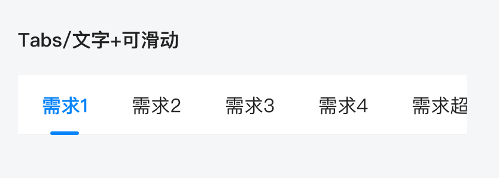

# BrnTabBar

适用于多 tab 切换的场景

## 一、效果总览


## 二、描述

### 适用场景

1. 页面顶部 TabBar 和页面间的联动；
2. BrnTabBar 中的每个 Tab 支持【小红点】显示；
3. 支持顶部显示角标；
4. 支持 Tab 间显示分隔线。

### 注意事项

1. **！！通过 onTap 回调保证仅回调一次，Tababr 的 controller 的 Listener 会调用两次，不推荐使用**。
2. 如果需要 Tab 从左向右紧贴边显示，只需要设置 tabWidth，就不会对屏幕宽度进行均分显示。
3. 目前支持每个 tab 的文本自适应展开，参考**示例五。**
4. 当前组件需要增加 with TickerProviderStateMixin。
5. isScroll 字段为 true 时，TabItem 根据自身实际宽度展示，并从左到右依次排列，可以结合 mode 设置为 ORIGIN，实现 TabItem 不等宽靠左排列效果。

## 三、构造函数及参数说明

### 构造函数

```dart
BrnTabBar({
  required this.tabs,
  this.mode = BrnTabBarBadgeMode.average,
  this.isScroll = false,
  this.tabHeight,
  this.padding = EdgeInsets.zero,
  this.controller,
  this.backgroundcolor = const Color(0xffffffff),
  this.indicatorColor,
  this.indicatorWeight,
  this.indicatorWidth,
  this.indicatorPadding = EdgeInsets.zero,
  this.labelColor,
  this.labelStyle,
  this.labelPadding = EdgeInsets.zero,
  this.unselectedLabelColor,
  this.unselectedLabelStyle,
  this.dragStartBehavior = DragStartBehavior.start,
  this.onTap,
  this.tabWidth,
  this.hasDivider = false,
  this.hasIndex = false,
  this.showMore = false,
  this.moreWindowText,
  this.onMorePop,
  this.closeController,
  this.themeData,
  this.tagSpacing,
  this.preLineTagCount,
  this.tagHeight,
}) : assert(tabs != null) {
  this.themeData ??= BrnTabBarConfig();
  this.themeData = BrnThemeConfigurator.instance
      .getConfig(configId: this.themeData!.configId)
      .tabBarConfig
      .merge(this.themeData);
  this.themeData = this.themeData!.merge(BrnTabBarConfig(
    tabHeight: tabHeight,
    indicatorHeight: indicatorWeight,
    indicatorWidth: indicatorWidth,
    labelStyle: BrnTextStyle.withStyle(labelStyle),
    unselectedLabelStyle: BrnTextStyle.withStyle(unselectedLabelStyle),
    tagSpacing: tagSpacing,
    preLineTagCount: preLineTagCount,
    tagHeight: tagHeight,
  ));
}
```

### 参数说明

| **参数名**           | **参数类型**              | **描述**                                                     | **是否必填** | **默认值**                                             |
| -------------------- | ------------------------- | ------------------------------------------------------------ | ------------ | ------------------------------------------------------ |
| tabs                 | List                      | 组件每个 Tab 的数据集                                        | 是           | 无                                                     |
| mode                 | BrnTabBarBadgeMode        | Tabbar 的模式，默认为等分模式 BrnTabBarBadgeMode.average，切换为 origin 基本为原生的 Tabbar 分配模式 | 否           | BrnTabBarBadgeMode.average                             |
| isScroll             | bool                      | 是否能滑动(当 tab 数量大于 4 个，默认都是滚动的，再设置此属性无效) | 否           | false                                                  |
| tabHeight            | double?                   | BrnTabBar 的最小高度                                         | 否           | 50                                                     |
| padding              | EdgeInsetsGeometry        | BrnTabBar 的 padding                                         | 否           | EdgeInsets.zero                                        |
| controller           | TabController?            | 组件和 TabBarView 联动控制器                                 | 否           | 无                                                     |
| backgroundcolor      | Color                     | 组件整体背景色                                               | 否           | Color(0xffffffff)                                      |
| indicatorColor       | Color?                    | 指示器的颜色                                                 | 否           | 无                                                     |
| indicatorWeight      | double?                   | 指示器的高度                                                 | 否           | 2                                                      |
| indicatorWidth       | double?                   | 指示器的宽度                                                 | 否           | 24                                                     |
| indicatorPadding     | EdgeInsetsGeometry        | 指示器的 padding                                             | 否           | EdgeInsets.zero                                        |
| labelColor           | Color?                    | 选中 Tab 文本的颜色                                          | 否           | APP 主题色/品牌色                                      |
| labelStyle           | TextStyle?                | 选中 Tab 文本的样式                                          | 否           | TextStyle(fontSize: 16, fontWeight: FontWeight.w600)   |
| labelPadding         | EdgeInsetsGeometry        | 选中 Tab 文本的 padding                                      | 否           | EdgeInsets.zero                                        |
| unselectedLabelColor | Color?                    | 未选中 Tab 文本的颜色                                        | 否           | 纯黑文字 #222222                                       |
| unselectedLabelStyle | TextStyle?                | 未选中 Tab 文本的样式                                        | 否           | TextStyle(fontSize: 16, fontWeight: FontWeight.normal) |
| dragStartBehavior    | DragStartBehavior         | 处理拖动开始的行为                                           | 否           | DragStartBehavior.start                                |
| onTap                | BrnTabBarOnTap?           | 底部按钮之间的分割线                                         | 否           | 无                                                     |
| tabWidth             | double?                   | 组件每个 Tab 的宽度                                          | 否           | 无                                                     |
| hasDivider           | bool                      | 是否显示 Tab 间分隔线                                        | 否           | false：不显示                                          |
| hasIndex             | bool                      | 是否显示 Tab 文本上面角标                                    | 否           | false：不显示                                          |
| showMore             | bool                      | 是否展开更多 Tabs                                            | 否           | false：不显示                                          |
| moreWindowText       | String?                   | 展开更多弹框标题                                             | 否           | 无                                                     |
| onMorePop            | VoidCallback?             | 更多弹框弹出的时候回调                                       | 否           | 无                                                     |
| closeController      | BrnCloseWindowController? | 更多弹框关闭控制器                                           | 否           | 无                                                     |
| tagSpacing           | double?                   | tag 间距                                                     | 否           | 12                                                     |
| preLineTagCount      | int?                      | 每行 tag 数                                                  | 否           | 4                                                      |
| tagHeight            | double?                   | tag 高度                                                     | 否           | 32                                                     |
| themeData            | BrnTabBarConfig?          | tabBar 配置信息，配置详情见 BrnTabBarConfig                  | 否           | 无                                                     |

## 四、代码演示

### 效果1：文字+角标


```dart
var tabs = List<BadgeTab>();
tabs.add(BadgeTab(text: "需求1", badgeNum: 26));
tabs.add(BadgeTab(text: "需求2"));
TabController tabController =
TabController(length: tabs.length, vsync: this);
return BrnTabBar(
  controller: tabController,
  tabs: tabs,
  onTap: (state, index) {
    state.refreshBadgeState(index);
  },
);
```

### 效果2：文字


```dart
var tabs = List<BadgeTab>();
tabs.add(BadgeTab(text: "需求需求"));
tabs.add(BadgeTab(text: "需求需求"));
tabs.add(BadgeTab(text: "需求需求"));
tabs.add(BadgeTab(text: "需求需求"));
TabController tabController =
TabController(length: tabs.length, vsync: this);
return BrnTabBar(
  controller: tabController,
  tabs: tabs,
);
```

### 效果3：文字+可滑动



```dart
var tabs = List<BadgeTab>();
tabs.add(BadgeTab(text: "需求1"));
tabs.add(BadgeTab(text: "需求2"));
tabs.add(BadgeTab(text: "需求3"));
tabs.add(BadgeTab(text: "需求4"));
tabs.add(BadgeTab(text: "需求超出了"));
TabController tabController =
TabController(length: tabs.length, vsync: this);
return BrnTabBar(
  controller: tabController,
  tabs: tabs,
);
```

### 效果4：文字+竖线+数字


```dart
var tabs = List<BadgeTab>();
tabs.add(BadgeTab(text: "需求",topText: '1'));
tabs.add(BadgeTab(text: "需求", topText: '2'));
tabs.add(BadgeTab(text: "需求",topText: '3'));
tabs.add(BadgeTab(text: "需求",topText: '4'));
TabController tabController =
TabController(length: tabs.length, vsync: this);
return BrnTabBar(
  controller: tabController,
  tabs: tabs,
  hasIndex: true,
  hasDivider: true,
  onTap: (state, index) {
  },
);
```

### 效果5：自适应模式，保留原生 Tabbar 功能


```dart
var tabs = List<BadgeTab>();
tabs.add(BadgeTab(text: "特殊业务详情一", badgeText: "新"));
tabs.add(BadgeTab(text: "业务二", badgeNum: 22));
tabs.add(BadgeTab(text: "业务三", badgeNum: 11));
tabs.add(BadgeTab(text: "业务四", showRedBadge: true));
tabs.add(BadgeTab(text: "业务五", badgeNum: 12));
tabs.add(BadgeTab(text: "业务六", badgeNum: 30));
tabs.add(BadgeTab(text: "业务七"));
tabs.add(BadgeTab(text: "业务八", badgeNum: 23));
tabs.add(BadgeTab(text: "业务九"));
TabController tabController =
TabController(length: tabs.length, vsync: this);
return BrnTabBar(
  controller: tabController,
  tabs: tabs,
  mode: BrnTabBarBadgeMode.origin,
  isScroll: false,
  labelPadding: EdgeInsets.only(left:20,right: 12),
  indicatorPadding: EdgeInsets.only(left: 10),
  onTap: (state, index) {
    BrnToast.show("点击了", context);
  },
);
```

### 效果6：展开收起


```dart
var tabs = List<BadgeTab>();
tabs.add(BadgeTab(text: "业务一"));
tabs.add(BadgeTab(text: "业务二"));
tabs.add(BadgeTab(text: "业务三"));
tabs.add(BadgeTab(text: "业务四"));
tabs.add(BadgeTab(text: "业务五"));
TabController tabController = TabController(length: tabs.length, vsync: this);
return BrnTabBar(
  controller: tabController,
  tabs: tabs,
  showMore: true,
  moreWindowText: "Tabs描述",
  closeController: closeWindowController,
  onTap: (state, index) {
    state.refreshBadgeState(index);
  },
);
```
