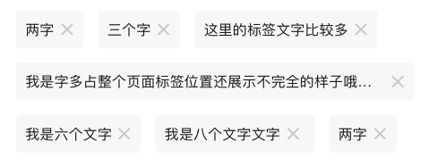
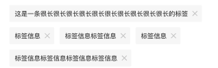
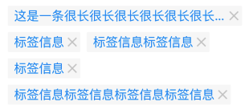

# BrnDeleteTag

可删除标签

## 一、效果总览

 


## 二、描述

### 适用场景

1. 删除模式下流式的标签

2. 宽高间距可设置

3. 支持标签数量的增删


## 三、构造函数与参数配置

### 构造函数

```dart
BrnDeleteTag(
    {Key? key,
    this.tags,
    this.controller,
    this.onTagDelete,
    this.verticalSpacing,
    this.horizontalSpacing,
    this.tagTextStyle,
    this.shape,
    this.backgroundColor,
    this.deleteIconColor,
    this.deleteIconSize,
    this.softWrap = true,
    this.padding = const EdgeInsets.fromLTRB(20, 0, 20, 0),
    this.themeData})
    : super(key: key) {
  themeData ??= BrnTagConfig();
  themeData = themeData!.merge(BrnTagConfig(
      tagBackgroundColor: this.backgroundColor,
      tagTextStyle: BrnTextStyle.withStyle(tagTextStyle)));
  themeData = BrnThemeConfigurator.instance
      .getConfig(configId: themeData!.configId)
      .tagConfig
      .merge(this.themeData);
```


### 参数说明

| **参数名** | **参数类型** | **描述** | **是否必填** | **默认值** |
| --- | --- | --- | --- | --- |
| tags | `List<String>?` | 展示的标签列表 | 是 |  |
| controller | BrnDeleteTagController? | 标签控制器，用于主动添加标签，如果只需要删除标签并进行回调可以不传控制器 | 否 |  |
| onTagDelete | `Function(List<String>, String?, int)?` | 点击删除某个标签后将现有的所有标签，删除的标签内容，删除的标签index回传 | 否 |  |
| verticalSpacing | double? | 垂直方向的间距 | 否 | 10 |
| horizontalSpacing | double? | 水平方向的间距  | 否 | 10，softWrap false 时 12 |
| tagTextStyle | TextStyle? | 标签的字体样式 | 否 |  |
| shape | OutlinedBorder? | 标签的圆角 | 否 |  |
| backgroundColor | Color? | 标签背景色 | 否 |  |
| deleteIconSize | Size? | 设置删除 Icon的大小  | 否 | 默认值为内置删除 icon 的图片大小。 |
| deleteIconColor | Color? | 删除图标的颜色 | 否 |  |
| softWrap | bool  | 是否为流式布局true流式，false横向滑动  | 否 | true |
| padding | EdgeInsets | 内容边距 | 否 | EdgeInsets.fromLTRB(20, 0, 20, 0) |
| themeData; | BrnTagConfig? | 主题配置信息，包含标签背景色、文本颜色等字段 | 否 |  |

### BrnDeleteTagController

标签的控制器，用于需要主动添加标签的场景

| 方法名 | **参数类型** | **作用** |
| --- | --- | --- |
| setTags | `List<String>` | 设置标签 |
| addTags | `List<String>` | 将标签集合添加到现有的标签集合中 |
| addTag | String | 添加一个标签 |
| clear | Function | 清空标签 |
| deleteForIndex | int | 删除某个index底下tag |
| deleteForTag | String | 删除某个已知的标签 |


## 四、效果及代码展示

### 效果1： 默认样式

 

```dart
BrnDeleteTagController controller = BrnDeleteTagController(initTags: [
'这是一条很长很长很长很长很长很长很长很长很长很长的标签',
'标签信息',
'标签信息标签信息',
'标签信息',
'标签信息标签信息标签信息标签信息'
]);

// DeleteTag组件  
BrnDeleteTag(
  controller: controller,
  onTagDelete: (tags, tag, index) {
    BrnToast.show('剩余的标签为：${tags.toString()},删除了的标签为：$tag  ,删除的标签index为$index', context);
  },
)

// 主动添加或者删除标签  
IconButton(icon: Icon(Icons.delete_forever),  onPressed: () => controller.deleteForIndex(0),)
```


### 效果2： 自定义标签样式、删除 icon Size

 

```dart
BrnDeleteTagController controller = BrnDeleteTagController(initTags: [
'这是一条很长很长很长很长很长很长很长很长很长很长的标签',
'标签信息',
'标签信息标签信息',
'标签信息',
'标签信息标签信息标签信息标签信息'
]);

// DeleteTag组件  
BrnDeleteTag(
  controller: controller,
  tagTextStyle: TextStyle(color: Colors.blue, fontSize: 20),
  deleteIconSize: Size(16, 16),
  onTagDelete: (tags, tag, index) {
    BrnToast.show('剩余的标签为：${tags.toString()},删除了的标签为：$tag  ,删除的标签index为$index', context);
  },
)

// 主动添加或者删除标签  
IconButton(icon: Icon(Icons.delete_forever),  onPressed: () => controller.deleteForIndex(0),)
```

