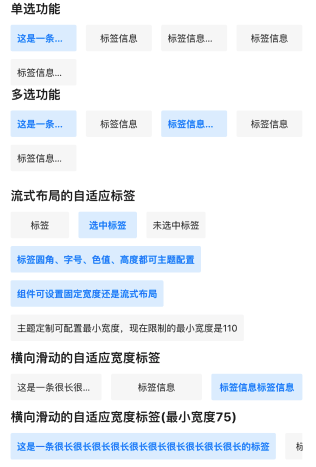
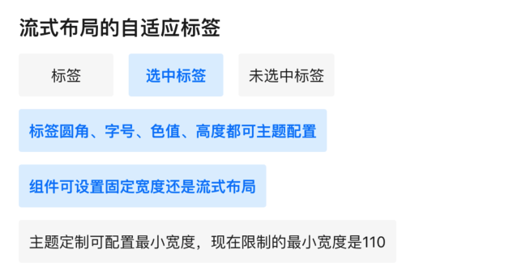

# BrnSelectTag

标签组件

## 一、效果总览

 


## 二、描述

### 适用场景

1. 支持流式和横向布局

2. 支持定宽和非定宽

3. 宽高间距可设置

4. 支持单选和多选


## 三、构造函数与参数配置

### 构造函数

```dart
BrnSelectTag({
  Key? key,
  required this.tags,
  this.onSelect,
  this.spacing = 12,
  this.verticalSpacing = 10,
  this.tagTextStyle,
  this.selectedTagTextStyle,
  this.tagBackgroundColor,
  this.selectedTagBackgroundColor,
  this.tagWidth,
  this.tagHeight,
  this.isSingleSelect = true,
  this.initTagState,
  this.softWrap = true,
  this.alignment = Alignment.centerLeft,
  this.fixWidthMode = true,
  this.themeData,
}) : super(key: key) {
  if (isSingleSelect == true) {
    assert(initTagState == null || (initTagState!.length <= 1));
  }
  this.themeData ??= BrnTagConfig();
  this.themeData = BrnThemeConfigurator.instance
      .getConfig(configId: this.themeData!.configId)
      .tagConfig
      .merge(this.themeData);
  this.themeData = this.themeData!.merge(BrnTagConfig(
      tagBackgroundColor: this.tagBackgroundColor,
      tagTextStyle: BrnTextStyle.withStyle(this.tagTextStyle),
      selectTagTextStyle: BrnTextStyle.withStyle(this.selectedTagTextStyle),
      tagWidth: this.tagWidth,
      tagHeight: this.tagHeight,
      selectedTagBackgroundColor: this.selectedTagBackgroundColor));
}
```


### 参数说明

| **参数名** | **参数类型** | **描述** | **是否必填** | **默认值** |
| --- | --- | --- | --- | --- |
| tags | `List<String>` | 展示的标签列表 | 是 |  |
| onSelect | `void Function(List<int>)?` | 点击标签的回调， | 否 |  |
| spacing | double | 水平间距 | 否 | 12 |
| verticalSpacing | double | 垂直间距 | 否 | 10 |
| tagTextStyle | TextStyle? | 普通标签的样式 | 否 |  |
| selectedTagTextStyle | TextStyle? | 选中的标签样式 | 否 |  |
| tagBackgroundColor | Color? | 普通标签背景色 | 否 | F0Color |
| selectedTagBackgroundColor | Color? | 选中的标签背景色 | 否 | B0Color |
| tagWidth | double? | 标签宽度 | 否 | 75 |
| tagHeight | double? | 标签高度 | 否 | 34 |
| isSingleSelect | bool | 是否是单选 | 否 | true |
| initTagState | `List<bool>?` | 初始选中的标签状态 | 否 |  |
| softWrap | bool | 是否为流式布局，true流式，false横向滑动 | 否 | true |
| aligment | Alignment | 对齐模式，默认为靠左 | 否 | Alignment.centerLeft |
| fixWidthMode | bool | 是否为宽度固定模式，true宽度固定，false宽度自适应 | 否 | true |
| themeData | BrnTagConfig? | 主题定制属性 | 否 |  |


## 四、效果及代码展示

### 效果1：单选 Tag，标签等宽

 


```dart
List<String> tagList = [
    '这是一条很长很长很长很长很长很长很长很长很长很长的标签',
    '标签信息',
    '标签信息标签信息',
    '标签信息',
    '标签信息标签信息标签信息标签信息'
  ];

BrnSelectTag(
    tags: tagList,
    spacing: 12,
    tagWidth: _getTagWidth(context),
    initTagState: [true],
    onSelect: (selectedIndexes) {
      BrnToast.show(selectedIndexes.toString(), context);
    })
    
double _getTagWidth(context, {int rowCount : 4}) {
  double leftRightPadding = 40;
  double rowItemSpace = 12;
  return MediaQuery.of(context).size.width - leftRightPadding - rowItemSpace * (rowCount - 1) / rowCount;
}
```
### 效果2： 多选 Tag，标签等宽

 

```dart
List<String> tagList = [
    '这是一条很长很长很长很长很长很长很长很长很长很长的标签',
    '标签信息',
    '标签信息标签信息',
    '标签信息',
    '标签信息标签信息标签信息标签信息'
  ];

BrnSelectTag(
    tags: tagList,
    spacing: 12,
    isSingleSelect: false,
    tagWidth: _getTagWidth(context),
    initTagState: [true],
    onSelect: (selectedIndexes) {
      BrnToast.show(selectedIndexes.toString(), context);
    })
    
double _getTagWidth(context, {int rowCount : 4}) {
  double leftRightPadding = 40;
  double rowItemSpace = 12;
  return MediaQuery.of(context).size.width - leftRightPadding - rowItemSpace * (rowCount - 1) / rowCount;
}
```


### 效果3： 横向滑动，标签等宽

 

```dart
List<String> tagList = [
    '这是一条很长很长很长很长很长很长很长很长很长很长的标签',
    '标签信息',
    '标签信息标签信息',
    '标签信息',
    '标签信息标签信息标签信息标签信息'
  ];

BrnSelectTag(
    tags: tagList,
    tagWidth: _getTagWidth(context),
    softWrap: false,
    onSelect: (index) {
      BrnToast.show("$index is selected", context);
    })
    
    
double _getTagWidth(context, {int rowCount : 4}) {
  double leftRightPadding = 40;
  double rowItemSpace = 12;
  return MediaQuery.of(context).size.width - leftRightPadding - rowItemSpace * (rowCount - 1) / rowCount;
}

```


### 效果4： 横向滑动的自适应宽度标签(最小宽度75)

 

```dart
List<String> tagList = [
    '这是一条很长很长很长很长很长很长很长很长很长很长的标签',
    '标签信息',
    '标签信息标签信息',
    '标签信息',
    '标签信息标签信息标签信息标签信息'
  ];

BrnSelectTag(
    tags: tagList,
    tagWidth: _getTagWidth(context),
    softWrap: false, /// 设置单行展示
    fixWidthMode: false, /// 设置非等宽
    onSelect: (index) {
      BrnToast.show("$index is selected", context);
    })
    

double _getTagWidth(context, {int rowCount : 4}) {
  double leftRightPadding = 40;
  double rowItemSpace = 12;
  return MediaQuery.of(context).size.width - leftRightPadding - rowItemSpace * (rowCount - 1) / rowCount;
}
```


### 效果5：流式布局，自适应宽度标签

 

```dart
BrnSelectTag(
  tags: [
    '标签',
    '选中标签',
    '未选中标签',
    '标签圆角、字号、色值、高度都可主题配置',
    '组件可设置固定宽度还是流式布局',
    '主题定制可配置最小宽度，现在限制的最小宽度是110'
  ],
  isSingleSelect: false,
  fixWidthMode: false,
  spacing: 12,
  onSelect: (selectedIndexes) {
    BrnToast.show(selectedIndexes.toString(), context);
  }
)
```
