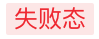

# BrnStateTag

## 一、效果总览


## 二、描述

### 适用场景

1. 显示状态的标签，表示当前事件的进行状态，枚举出了常用的 5 种状态，如不满足业务方可进行自定义。

2. 自定义的文字颜色和背景颜色优先级更高，如果设置了就会显示自定义的颜色。

## 三、构造函数及参数说明

### 构造函数

```dart
const BrnStateTag({
    Key? key,
    required this.tagText,
    this.tagState = TagState.waiting,
    this.backgroundColor,
    this.textColor,
  }) : super(key: key);
```

### 参数说明

| **参数名**      | **参数类型** | **描述**           | **是否必填** | **默认值**         |
| --------------- | ------------ | ------------------ | ------------ | ------------------ |
| tagText         | String       | 标签显示文本       | 是           |                    |
| tagState        | TagState     | 标签状态           | 否           | TagState.waiting   |
| backgroundColor | Color?       | 自定义标签背景颜色 | 否           | 0xFFFAAD14 10%透明 |
| textColor       | Color?       | 自定义标签文字颜色 | 否           | 0xFFFAAD14         |

其中 TagState 为枚举，共 5 种状态：

```dart
enum TagState {
  waiting,    /// 等待状态，文字和背景为黄色
  invalidate, /// 无效状态，文字和背景为灰色
  running,    /// 运行状态，文字和背景为蓝色
  failed,     /// 失败状态，文字和背景为红色
  succeed     /// 成功状态，文字和背景为绿色
}
```

## 四、效果及代码演示

### 效果 1


```dart
BrnStateTag(
  tagText: '成功态',
  tagState: TagState.succeed,
)
```

### 效果 2



```dart
BrnStateTag(
  tagText: '失败态',
  tagState: TagState.failed,
)
```
