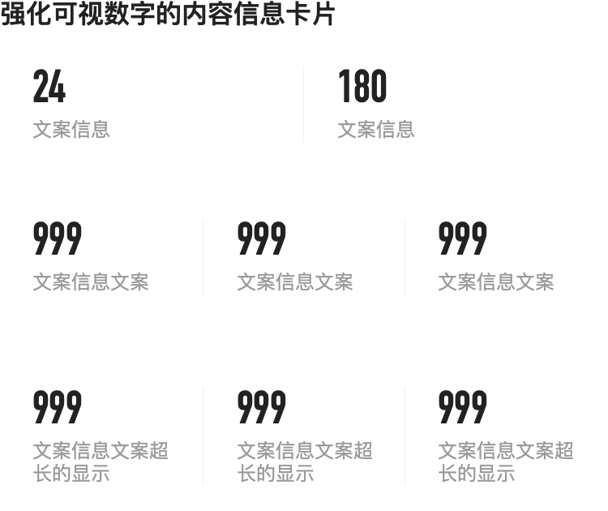
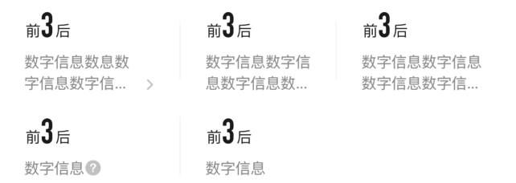

# BrnEnhanceNumberCard
常用于卡片中强化展示 数字信息

## 一、效果总览


 


## 二、描述

### 适用场景

1、常用于卡片中强化展示 数字信息，比如成交量

### **注意事项**

1、需要强化的信息，必须是非中文（BrnNumberInfoItemModel的number 字段），否则会显示异常，如下所示：

 


## 三、构造函数及参数说明

### 构造函数

```dart
BrnEnhanceNumberCard({
  Key? key,
  this.itemChildren,
  this.rowCount = 3,
  this.runningSpace,
  this.itemRunningSpace,
  this.padding = const EdgeInsets.only(left: 20, right: 20),
  this.backgroundColor = Colors.white,
  this.itemTextAlign = TextAlign.left,
  this.themeData,
}) : super(key: key);
```
### 参数说明

| **参数名** | **参数类型** | **描述** | **是否必填** | **默认值** |
| --- | --- | --- | --- | --- |
| itemChildren | `List<BrnNumberInfoItemModel>?` | 待展示的信息 | 否 | 无 |
| rowCount | int | 每行展示的item的数量 | 否 | 3 |
| runningSpace | double? | 如果超过一行，则展示行间距则 | 否 | 16 |
| itemRunningSpace | double? | Item的上半部分和下半部分的间距 | 否 | 8 |
| padding | EdgeInsets | 元件左右侧的边距 | 否 | EdgeInsets.only(left: 20, right: 20) |
| backgroundColor | Color | 背景色 默认为白色 | 否 | Colors.white |
| itemTextAlign | TextAlign | 文本内容对齐方式 | 否 | TextAlign.left |
| themeData | BrnEnhanceNumberCardConfig? | 主题定制属性 | 否 | 无 |


## 四、代码演示

### 效果1：单列数据

 

```dart
BrnEnhanceNumberCard(
  itemChildren: [
    BrnNumberInfoItemModel(
      title: '数字信息',
      number: '3',
    )
  ],
)
```


### 效果2：单列带前后描述信息

 

```dart
BrnEnhanceNumberCard(
  itemChildren: [
    BrnNumberInfoItemModel(
        title: '数字信息',
        number: '3',
        preDesc: '前',
        lastDesc: '后',
        numberInfoIcon: BrnNumberInfoIcon.ARROW,
        iconTapCallBack: (data) {}),
  ],
)
```


### 效果3：双列数据

 

```dart
BrnEnhanceNumberCard(
  rowCount: 2,
  itemChildren: [
    BrnNumberInfoItemModel(
      title: '文案信息',
      number: '24',
    ),
    BrnNumberInfoItemModel(
      title: '文案信息',
      number: '180',
    ),
  ],
)
```


### 效果4：单行三列情况

 

```dart
BrnEnhanceNumberCard(
  rowCount: 3,
  itemChildren: [
    BrnNumberInfoItemModel(
      title: '数字信息',
      number: '3',
      preDesc: '前',
      lastDesc: '后',
    ),
    BrnNumberInfoItemModel(
      title: '数字信息',
      number: '3',
      preDesc: '前',
      lastDesc: '后',
    ),
    BrnNumberInfoItemModel(
      title: '数字信息',
      number: '3',
      preDesc: '前',
      lastDesc: '后',
    ),
  ],
)
```


### 效果5：其他展示效果

 
```dart
BrnEnhanceNumberCard(
  rowCount: 3,
  itemChildren: [
    BrnNumberInfoItemModel(
        title: '数字信息数息数字信息数字信息数息数字信息数字信息数息数字信息',
        number: '3',
        preDesc: '前',
        lastDesc: '后',
        numberInfoIcon: BrnNumberInfoIcon.ARROW,
        iconTapCallBack: (data) {
          BrnToast.show(data.title, context);
        }),
    BrnNumberInfoItemModel(
      title: '数字信息数字信息数字信息数字信息数字信息数字信息',
      number: '3',
      preDesc: '前',
      lastDesc: '后',
    ),
    BrnNumberInfoItemModel(
      title: '数字信息数字信息数字信息数字信息数字信息数字信息',
      number: '3',
      preDesc: '前',
      lastDesc: '后',
    ),
    BrnNumberInfoItemModel(
        title: '数字信息',
        number: '3',
        preDesc: '前',
        lastDesc: '后',
        iconTapCallBack: (data) {}),
    BrnNumberInfoItemModel(
      title: '数字信息',
      number: '3',
      preDesc: '前',
      lastDesc: '后',
    ),
  ],
)
```

