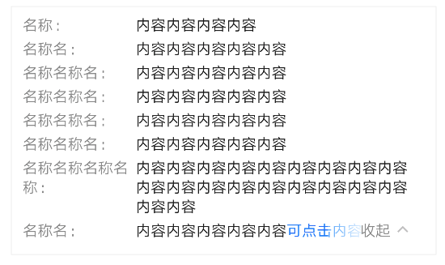
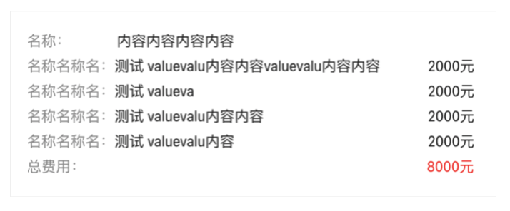
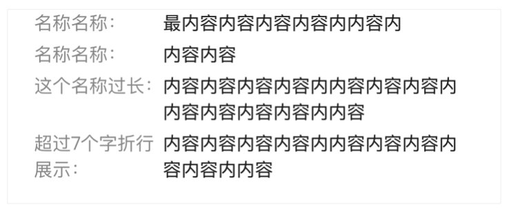
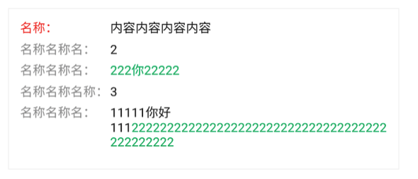

# BrnPairInfoTable

## 一、效果总览



## 二、描述

### 适用场景

1. 页面或者卡片中，单列的展示 Key-Value 文本数据

## 三、构造函数及参数说明

### 构造函数

```dart
BrnPairInfoTable({
    Key? key,
    required this.children,
    this.defaultVerticalAlignment = TableCellVerticalAlignment.baseline,
    this.isValueAlign = true,
    this.expandAtIndex = -1,
    this.rowDistance,
    this.itemSpacing,
    this.isFolded = true,
    this.onFolded,
    this.customKeyWidth,
    this.themeData
  });
```

### 参数说明

| **参数名**               | **参数类型**               | **描述**                                                     | **是否必填** | **默认值**      |
| ------------------------ | -------------------------- | ------------------------------------------------------------ | ------------ | --------------- |
| children                 | List                       | 待展示的文本信息                                             | 是           | 无              |
| isValueAlign             | bool                       | value 是否对齐                                               | 否           | 无              |
| defaultVerticalAlignment | TableCellVerticalAlignment | TableCell 默认垂直对齐方式， 默认值为 [TableCellVerticalAlignment.baseline]，当 [BrnInfoModal.valuePart] 为自定义 Widget 时，可设置该参数调整对齐方式，仅在 [isValueAlign] 为 true 时设置才生效 | 否           |                 |
| expandAtIndex            | int                        | 从第几个位置开始展开收起，-1 表示不需要展开收起功能          | 否           | -1              |
| rowDistance              | double?                    | 行与行之间的间距                                             | 否           | 4               |
| itemSpacing              | double?                    | key-value 之间的间距                                         | 否           | 2               |
| isFolded                 | true                       | 初始的展开收起状态                                           | 否           | bool            |
| onFolded               | `ValueChanged<bool>?`      | 展开手气状态变化的回调                                       | 否           | 无              |
| customKeyWidth           | TableColumnWidth?          | 对齐情况下，自定义的key展示规则，默认是最大的Key展示长度是107，可以参考[_MaxWrapTableWidth]实现自定义的展示规则，指定长度等 | 否           | key 最大宽度 94 |
| themeData                | BrnPairInfoTableConfig?    | 主题定制属性                                                 | 否           |                 |

## 四、代码演示

### 效果 1：默认收起且有点击


```dart
BrnPairInfoTable(
  expandAtIndex: 3,
  children: <BrnInfoModal>[
    BrnInfoModal(keyPart: "名称：", valuePart: "内容内容内容内容"),
    BrnInfoModal(keyPart: "名称名：", valuePart: "内容内容内容内容内容"),
    BrnInfoModal(keyPart: "名称名称名：", valuePart: "内容内容内容内容内容"),
    BrnInfoModal(keyPart: "名称名称名：", valuePart: "内容内容内容内容内容"),
    BrnInfoModal(keyPart: "名称名称名：", valuePart: "内容内容内容内容内容"),
    BrnInfoModal(keyPart: "名称名称名：", valuePart: "内容内容内容内容内容"),
    BrnInfoModal(
        keyPart: "名称名称名称名称：", valuePart: "内容内容内容内容内容内容内容内容内容内容内容内容内容内容内容内容内容内容内容内容"),
    BrnInfoModal.valueLastClickInfo("名称名：", '内容内容内容内容内容', '可点击内容',
        clickCallback: (text) {
      BrnToast.show(text, context);
    }),
  ],
)
```

### 效果 2：默认收起且有点击


```dart
BrnPairInfoTable(
  expandAtIndex: 3,
  isFolded: false,
  children: <BrnInfoModal>[
    BrnInfoModal(keyPart: "名称：", valuePart: "内容内容内容内容"),
    BrnInfoModal(keyPart: "名称名：", valuePart: "内容内容内容内容内容"),
    BrnInfoModal(keyPart: "名称名称名：", valuePart: "内容内容内容内容内容"),
    BrnInfoModal(keyPart: "名称名称名：", valuePart: "内容内容内容内容内容"),
    BrnInfoModal(keyPart: "名称名称名：", valuePart: "内容内容内容内容内容"),
    BrnInfoModal(keyPart: "名称名称名：", valuePart: "内容内容内容内容内容"),
    BrnInfoModal(
        keyPart: "名称名称名称名称：", valuePart: "内容内容内容内容内容内容内容内容内容内容内容内容内容内容内容内容内容内容内容内容"),
    BrnInfoModal.valueLastClickInfo("名称名：", '内容内容内容内容内容', '可点击内容',
        clickCallback: (text) {
      BrnToast.show(text, context);
    }),
  ],
)
```

### 效果 3：普通的信息展示



```dart
BrnPairInfoTable(
 isValueAlign: true,
 children: [
   BrnInfoModal(
     keyPart: '名称名称:',
     valuePart: '最内容内容内容内容内容内容内',
   ),
   BrnInfoModal(
     keyPart: '名称名称:',
     valuePart: '内容内容',
   ),
   BrnInfoModal(
     keyPart: '这个名称过长:',
     valuePart: '内容内容内容内容内容内容内容内容内容内容内容内容内容内容内容内容内容内容内',
   ),
   BrnInfoModal(
     keyPart: '超过七个字折行展示:',
     valuePart: '内容内容内容内容内容内容内容内容内容内容内容内容内容内容内容内容内容内容内',
   ),
 ],
)
```

### 效果 4：自定义 keyPart widget



```dart
BrnPairInfoTable(
 children: <BrnInfoModal>[
   BrnInfoModal(keyPart:  Text(
     "名称：",
     overflow: TextOverflow.ellipsis,
     maxLines: 1,
     style: TextStyle(
       color:  Colors.red,
       fontWeight: FontWeight.w400,
       fontSize:  14,
     ),
   ), valuePart: "内容内容内容内容"),
   BrnInfoModal(keyPart: "名称名称名：", valuePart: "2"),BrnInfoModal.valueLastClickInfo(
       "名称名称名：", '', '222你22222', clickCallback: (text) {
     BrnToast.show(text, context);
   }),
   BrnInfoModal(keyPart: "名称名称名称：", valuePart: "3"),
   BrnInfoModal.valueLastClickInfo(
       "名称名称名：", '11111你好111', '222222222222222222222222222222222222222222222', clickCallback: (text) {
     BrnToast.show(text, context);
   }),
 ],
)
```

### 效果 5：自定义 valuePart widget


```dart
BrnPairInfoTable(
 children: <BrnInfoModal>[
   BrnInfoModal(keyPart: "名称：", valuePart: "内容内容内容内容"),
   BrnInfoModal(
       keyPart: "名称名称名：",
       valuePart: Row(
         children: [
           Expanded(
             child: Text(
               '测试 valuevalu内容内容valuevalu内容内容',
               maxLines: 1,
               overflow: TextOverflow.ellipsis,
               style: TextStyle(
                 color: BrunoColor.instance.F0Color,
                 fontWeight: FontWeight.w400,
                 fontSize: 14,
               ),
             ),
           ),
           Text(
             '2000元',
             style: TextStyle(
               color: BrunoColor.instance.F0Color,
               fontWeight: FontWeight.w400,
               fontSize: 14,
             ),
           )
         ],
       )),
   BrnInfoModal(
       keyPart: "名称名称名：",
       valuePart: Row(
         children: [
           Expanded(
             child: Text(
               '测试 valueva',
               maxLines: 1,
               overflow: TextOverflow.ellipsis,
               style: TextStyle(
                 color: BrunoColor.instance.F0Color,
                 fontWeight: FontWeight.w400,
                 fontSize: 14,
               ),
             ),
           ),
           Text(
             '2000元',
             style: TextStyle(
               color: BrunoColor.instance.F0Color,
               fontWeight: FontWeight.w400,
               fontSize: 14,
             ),
           )
         ],
       )),
   BrnInfoModal(
       keyPart: "名称名称名：",
       valuePart: Row(
         children: [
           Expanded(
             child: Text(
               '测试 valuevalu内容内容',
               maxLines: 1,
               overflow: TextOverflow.ellipsis,
               style: TextStyle(
                 color: BrunoColor.instance.F0Color,
                 fontWeight: FontWeight.w400,
                 fontSize: 14,
               ),
             ),
           ),
           Text(
             '2000元',
             style: TextStyle(
               color: BrunoColor.instance.F0Color,
               fontWeight: FontWeight.w400,
               fontSize: 14,
             ),
           )
         ],
       )),
   BrnInfoModal(
       keyPart: "名称名称名：",
       valuePart: Row(
         children: [
           Expanded(
             child: Text(
               '测试 valuevalu内容',
               maxLines: 1,
               overflow: TextOverflow.ellipsis,
               style: TextStyle(
                 color: BrunoColor.instance.F0Color,
                 fontWeight: FontWeight.w400,
                 fontSize: 14,
               ),
             ),
           ),
           Text(
             '2000元',
             style: TextStyle(
               color: BrunoColor.instance.F0Color,
               fontWeight: FontWeight.w400,
               fontSize: 14,
             ),
           )
         ],
       )),
   BrnInfoModal(
       keyPart: "总费用：",
       valuePart: Row(
         children: [
           Expanded(
             child: Text(
               '',
               maxLines: 1,
               overflow: TextOverflow.ellipsis,
               style: TextStyle(
                 color: BrunoColor.instance.F0Color,
                 fontWeight: FontWeight.w400,
                 fontSize: 14,
               ),
             ),
           ),
           Text(
             '8000元',
             style: TextStyle(
               color: Colors.red,
               fontWeight: FontWeight.w400,
               fontSize: 14,
             ),
           )
         ],
       )),
 ],
```
