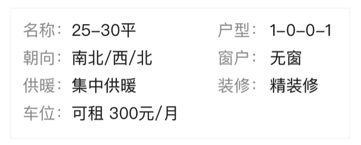
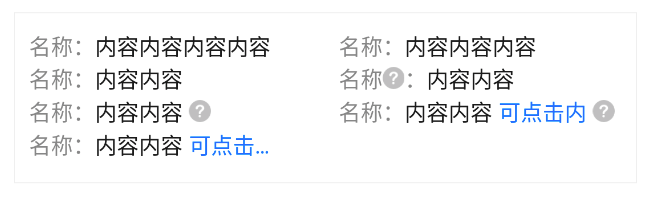

# BrnRichInfoGrid

## 一、效果总览


<br />


## 二、描述

### 适用场景

1. 常用于详情页中两列的信息展示

2. 兼容了非通栏的情况，如果使用 Row 包裹，则使用 Expanded 将其包裹

## 三、构造函数及参数说明

### 构造函数

```dart
BrnRichInfoGrid({
  Key? key,
  this.pairInfoList,
  this.padding,
  this.rowSpace,
  this.space,
  this.itemHeight,
  this.crossAxisCount = 2,
  this.themeData,
}) : super(key: key);
```

### 参数说明

| **参数名**     | **参数类型**               | **描述**          | **是否必填** | **默认值**       |
| -------------- | -------------------------- | ----------------- | ------------ | ---------------- |
| pairInfoList   | `List<BrnRichGridInfo>?`   | 待展示的文本信息  | 是           | 无               |
| padding        | EdgeInsetsGeometry?        | 字体大小          | 否           | 无               |
| rowSpace       | double?                    | 纵向间距          | 否           | 4                |
| space          | double?                    | 横向间距          | 否           | 2                |
| itemHeight     | double?                    | item 的高度       | 否           | 和文字相关的行高 |
| crossAxisCount | int                        | GridView 分为几列 | 否           | 2                |
| themeData      | BrnPairRichInfoGridConfig? | 主题定制属性      | 否           | 无               |

## 四、代码演示

### 效果 1


```dart
BrnRichInfoGrid(
  pairInfoList: [
    BrnRichGridInfo('名称:', '25-30平'),
    BrnRichGridInfo('户型:', '1-0-0-1'),
    BrnRichGridInfo('朝向:', '南北/西/北'),
    BrnRichGridInfo('窗户:', '无窗'),
    BrnRichGridInfo('供暖:', '集体供暖'),
    BrnRichGridInfo('装修:', '精装修'),
    BrnRichGridInfo('车位:', '可租 300元/月'),
  ],
)
```

### 效果 2：复杂元素


```dart
BrnRichInfoGrid(
  pairInfoList: <BrnRichGridInfo>[
    BrnRichGridInfo("名称：", '内容内容内容内容'),
    BrnRichGridInfo("名称：", '内容内容内容'),
    BrnRichGridInfo("名称：", '内容内容'),
    BrnRichGridInfo.valueLastClickInfo('名称', '内容内容',
        keyQuestionCallback: (value) {
      BrnToast.show(value, context);
    }),
    BrnRichGridInfo.valueLastClickInfo('名称', '内容内容',
        valueQuestionCallback: (value) {
      BrnToast.show(value, context);
    }),
    BrnRichGridInfo.valueLastClickInfo('名称', '内容内容',
        valueQuestionCallback: (value) {
          BrnToast.show(value, context);
        },
        clickTitle: "可点击内",
        clickCallback: (value) {
          BrnToast.show(value, context);
        }),
    BrnRichGridInfo.valueLastClickInfo('名称', '内容内容',
        clickTitle: "可点击内容", clickCallback: (value) {
      BrnToast.show(value, context);
    }),
  ],
)
```
