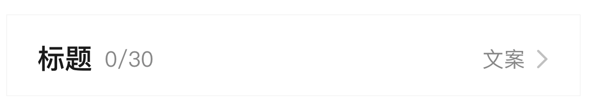

# BrnActionCardTitle

带右侧箭头的卡片标题

## 一、效果总览



## 二、描述

### 适用场景

卡片标题或者在 ListView 中的一行，点击可以进入下一个详情页

## 三、构造函数及参数说明

### 构造函数

```dart
BrnActionCardTitle({
    Key? key,
    required this.title,
    this.accessoryText,
    this.onTap,
    this.subTitle,
    this.subTitleWidget,
    this.themeData,
  }) : super(key: key);
```

### 参数说明

| **参数名**     | **参数类型**        | **描述**                            | **是否必填** | **默认值** |
| -------------- | ------------------- | ----------------------------------- | ------------ | ---------- |
| title          | String              | 标题文本                            | 是           |            |
| subTitle       | String？            | 标题右侧的小文字                    | 否           |            |
| subTitleWidget | Widget?             | 标题右侧的显示 widget               | 否           |            |
| accessoryText  | String?             | 箭头左边的文字                      | 否           |            |
| onTap          | VoidCallback?       | 整个标题点击的事件                  | 否           |            |
| themeData      | BrnCardTitleConfig? | 标题主题配置详见 BrnCardTitleConfig | 否           |            |

## 四、代码演示

### 效果 1：带评分和标签

&nbsp;

```dart
BrnActionCardTitle(
  title: '标题',
  subTitle: '0/30',
  accessoryText: '文案',
  onTap: () {
    BrnToast.show('BrnActionCardTitle is clicked', context);
  },
)
```
