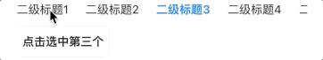

# BrnSubSwitchTitle

多个标题切换控件。

## 一、效果总览

### 适用场景简介


## 二、描述

### 适用场景

详情页的卡片中，多个子数据可切换，多用于详情卡片。

### 交互规则

标题过长时可滑动。

## 三、构造函数及参数说明

### 构造函数

```dart
const BrnSubSwitchTitle({
    Key? key,
    required this.nameList,
    this.defaultSelectIndex = 0,
    this.onSelect,
    this.padding,
    this.controller,
  }) : super(key: key);
```
### 参数说明

| **参数名** | **参数类型** | **描述** | **是否必填** | **默认值** |
| --- | --- | --- | --- | --- |
| nameList | `List<String>` | 标题的文案列表 | 是 | 无 |
| defaultSelectIndex | int | 默认选中的 index | 否 | 0 |
| onSelect | `void Function(int index)?` | 选择指定标题的回调 | 否 | 无 |
| padding | EdgeInsets? | 二级标题的padding | 否 | EdgeInsets.only(right: 20) |
| controller | TabController? | 控制tab切换，默认不需要传递 | 否 | 无 |

## 四、代码演示

### 效果1：基本样式


```dart
BrnSubSwitchTitle(  
  nameList: ['二级标题1', '二级标题2', '二级标题3'],  
  defaultSelectIndex: 0,  
  onSelect: (value) {  
    BrnToast.show(value.toString(), context);  
  },  
)
```

### 效果2：外部控制 tab



```dart
TabController _controller = TabController(
  initialIndex: 0,
  length: 6,
  vsync: this,
);

Column(
  mainAxisSize: MainAxisSize.min,
  crossAxisAlignment: CrossAxisAlignment.start,
  children: <Widget>[
    BrnSubSwitchTitle(
      nameList: ['二级标题1', '二级标题2', '二级标题3', '二级标题4', '二级标题5', '二级标题6'],
      defaultSelectIndex: 0,
      controller: _controller,
      onSelect: (value) {
        BrnToast.show(value.toString(), context);
      },
    ),
    Padding(
      padding: EdgeInsets.symmetric(vertical: 10),
      child: BrnSmallOutlineButton(
        title: '点击选中第三个',
        onTap: () {
          _controller.index = 1;
        },
      ),
    ),
  ]
)
```

