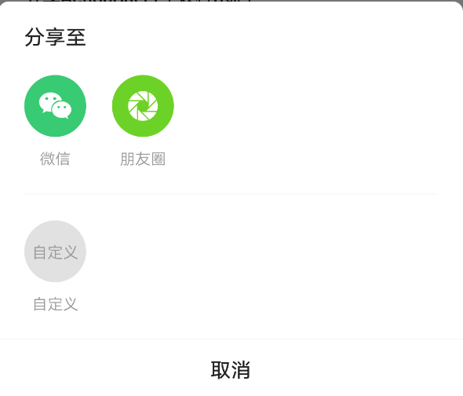
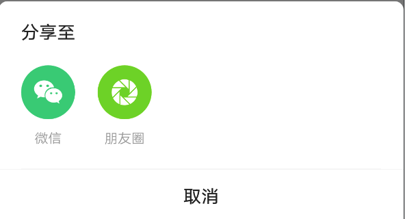

# BrnShareActionSheet

分享专用 ActionSheet

## 一、效果总览


<br/>

<br/>

<br/>


## 二、描述

### 适用场景

1. 吸底列表弹框

2. 可指定任意数量的需要展示的分享渠道图标（目前内设有：微信，朋友圈，qq，qq 空间，微博，链接，短信）

3. 如需展示内设渠道之外的分享渠道，支持自定义展示渠道图标

4. 可自定义取消按钮名称

## 三、构造函数及参数说明

### 构造函数

```dart
BrnShareActionSheet({
    this.firstShareChannels,
    this.secondShareChannels,
    this.mainTitle,
    this.clickCallBack,
    this.clickInterceptor,
    this.cancelTitle,
    this.shareTextColor = const Color(0xff999999),
    this.textColor = const Color(0xff222222),
  });
```

### 参数说明

#### BrnShareItem

| 参数名      | 参数类型 | 描述                                                                                          |
| ----------- | -------- | --------------------------------------------------------------------------------------------- |
| shareType   | int      | 分享类型（参考 BrnShareItemConstants 中的枚举，如果此项不为自定义，则自定义名称和图标不生效） |
| customTitle | String   | 自定义标题                                                                                    |
| customImage | Widget   | 自定义图标                                                                                    |
| canClick    | bool     | 是否可点击（如果为预设类型，设置为不可点击后会变为相应的置灰图标）默认为 true                 |

#### BrnShareActionSheet

| **参数名**            | **参数类型**                                                                               | **描述**                                                                                                                                                                    | **是否必填** | **默认值**                 |
| --------------------- | ------------------------------------------------------------------------------------------ | --------------------------------------------------------------------------------------------------------------------------------------------------------------------------- | ------------ | -------------------------- |
| firstShareChannels    | `List<BrnShareItem>`                                                                       | 第一行渠道列表                                                                                                                                                              | 否           | 空                         |
| secondShareChannels   | `List<BrnShareItem>`                                                                       | 第二行渠道列表                                                                                                                                                              | 否           |                            |
| mainTitle             | String                                                                                     | 列表标题                                                                                                                                                                    | 否           |                            |
| clickCallBack         | void ShareActionSheetItemClickCallBack( int section, int index, BrnShareItem shareItem)    | 点击分享渠道图标后回调方法                                                                                                                                                  | 否           | 空                         |
| getCustomChannelTitle | **ShareActionSheetGetCustomShareItemTitle**( int index)                                    | 获取自定义分享渠道对应的显示**文案**（方法传参为该自定义分享渠道在*shareChannels*中的索引值 index）。回调返回值为**String**，如果返回值为空，则**不显示**该自定义分享渠道。 | 否           | 空                         |
| cancelTitle           | String                                                                                     | 取消按钮的文案                                                                                                                                                              | 否           | **“取消”**                 |
| context               | BuildContext                                                                               | BuidContext                                                                                                                                                                 | 是           | 空                         |
| shareTextColor        | Color                                                                                      | 分享渠道文案颜色                                                                                                                                                            | 否           | **Color(0xff999999)**灰色  |
| textColor             | Color                                                                                      | 选项标题颜色                                                                                                                                                                | 否           | **Color(0xff222222)** 黑色 |
| clickInterceptor      | BrnShareActionSheetOnItemClickInterceptor( int section, int index, BrnShareItem shareItem) | 是否可点击（如果为预设类型，设置为不可点击后会变为相应的置灰图标）默认为 true                                                                                               | 否           |                            |

### 其他数据

| 常量名                             | 渠道名                                                                                                                                        |
| ---------------------------------- | --------------------------------------------------------------------------------------------------------------------------------------------- |
| BrnShareItemConstants.SHARE_WEIXIN | 微信                                                                                                                                          |
| BrnShareItemConstants.SHARE_FRIEND | 朋友圈                                                                                                                                        |
| BrnShareItemConstants.SHARE_QQ     | qq                                                                                                                                            |
| BrnShareItemConstants.SHARE_QZONE  | qq 空间                                                                                                                                       |
| BrnShareItemConstants.SHARE_WEIBO  | 微博                                                                                                                                          |
| BrnShareItemConstants.SHARE_LINK   | 链接                                                                                                                                          |
| BrnShareItemConstants.SHARE_SMS    | 短信                                                                                                                                          |
| BrnShareItemConstants.SHARE_CUSTOM | 自定义自定义图标需在**getCustomChannelTitle**方法中设置文案，在**getCustomChannelWidget**方法中设定图标。如其中一个为空，则不显示自定义图标。 |

## 效果及代码展示

### 效果 1： 六个分享渠道+两个自定义


```dart
List<BrnShareItem> firstRowList = List();
    firstRowList.add(BrnShareItem(
      BrnShareItemConstants.SHARE_WEIXIN,
      canClick: true,
    ));
    firstRowList.add(BrnShareItem(
      BrnShareItemConstants.SHARE_BROWSER,
      canClick: true,
    ));
    firstRowList.add(BrnShareItem(
      BrnShareItemConstants.SHARE_COPY_LINK,
      canClick: true,
    ));
    firstRowList.add(BrnShareItem(
      BrnShareItemConstants.SHARE_FRIEND,
      canClick: true,
    ));
    firstRowList.add(BrnShareItem(
      BrnShareItemConstants.SHARE_LINK,
      canClick: true,
    ));
    firstRowList.add(BrnShareItem(
      BrnShareItemConstants.SHARE_QQ,
      canClick: true,
    ));
    firstRowList.add(BrnShareItem(
      BrnShareItemConstants.SHARE_CUSTOM,
      customImage: BrunoTools.getAssetImage("images/icon_custom_share.png"),
      customTitle: "自定义",
      canClick: true,
    ));
    BrnShareActionSheet actionSheet = new BrnShareActionSheet(
      firstShareChannels: firstRowList,
      clickCallBack: (int section, int index, BrnShareItem shareItem) {
        int channel = shareItem.shareType;
        BrnToast.show("channel: $channel, section: $section, index: $index", context);
      },
      cancelTitle: "自定义取消名字", // 取消按钮title可自定义
    );
    actionSheet.show(context);

```

### 效果 2：四个分享渠道+四个自定义


```dart
List<BrnShareItem> firstRowList = List();
List<BrnShareItem> secondRowList = List();
firstRowList.add(BrnShareItem(
  BrnShareItemConstants.SHARE_QZONE,
  canClick: true,
));
firstRowList.add(BrnShareItem(
  BrnShareItemConstants.SHARE_SAVE_IMAGE,
  canClick: true,
));
firstRowList.add(BrnShareItem(
  BrnShareItemConstants.SHARE_SMS,
  canClick: true,
));
firstRowList.add(BrnShareItem(
  BrnShareItemConstants.SHARE_WEIBO,
  canClick: true,
));
secondRowList.add(BrnShareItem(
  BrnShareItemConstants.SHARE_QZONE,
  canClick: false,
));
secondRowList.add(BrnShareItem(
  BrnShareItemConstants.SHARE_SAVE_IMAGE,
  canClick: false,
));
secondRowList.add(BrnShareItem(
  BrnShareItemConstants.SHARE_SMS,
  canClick: false,
));
secondRowList.add(BrnShareItem(
  BrnShareItemConstants.SHARE_WEIBO,
  canClick: false,
));
BrnShareActionSheet actionSheet = new BrnShareActionSheet(
  firstShareChannels: firstRowList,
  secondShareChannels: secondRowList,
  clickCallBack: (int section, int index, BrnShareItem shareItem) {
    int channel = shareItem.shareType;
    BrnToast.show("channel: $channel, section: $section, index: $index", context);
  },
  clickInterceptor: (int section, int index, BrnShareItem shareItem) {
    if (shareItem.canClick) {
      return false;
    } else {
      BrnToast.show("不可点击，拦截了", context);
      return true;
    }
  },
);
actionSheet.show(context);
```

### 效果 3：上两个渠道+下一个自定义


```dart
List<BrnShareItem> firstRowList = List();
List<BrnShareItem> secondRowList = List();
firstRowList.add(BrnShareItem(
  BrnShareItemConstants.SHARE_WEIXIN,
  canClick: true,
));
firstRowList.add(BrnShareItem(
  BrnShareItemConstants.SHARE_FRIEND,
  canClick: true,
));
secondRowList.add(BrnShareItem(
  BrnShareItemConstants.SHARE_CUSTOM,
  customImage: BrunoTools.getAssetImage("images/icon_custom_share.png"),
  customTitle: "自定义",
  canClick: true,
));
BrnShareActionSheet actionSheet = new BrnShareActionSheet(
  firstShareChannels: firstRowList,
  secondShareChannels: secondRowList,
  clickCallBack: (int section, int index, BrnShareItem shareItem) {
    int channel = shareItem.shareType;
    BrnToast.show("channel: $channel, section: $section, index: $index", context);
  },
);
actionSheet.show(context);
```

### 效果 4：两个渠道


```dart
List<BrnShareItem> firstRowList = List();
firstRowList.add(BrnShareItem(
  BrnShareItemConstants.SHARE_WEIXIN,
  canClick: true,
));
firstRowList.add(BrnShareItem(
  BrnShareItemConstants.SHARE_FRIEND,
  canClick: true,
));
BrnShareActionSheet actionSheet = new BrnShareActionSheet(
  firstShareChannels: firstRowList,
  clickCallBack: (int section, int index, BrnShareItem shareItem) {
    int channel = shareItem.shareType;
    BrnToast.show("channel: $channel, section: $section, index: $index", context);
  },
);
actionSheet.show(context);
```
