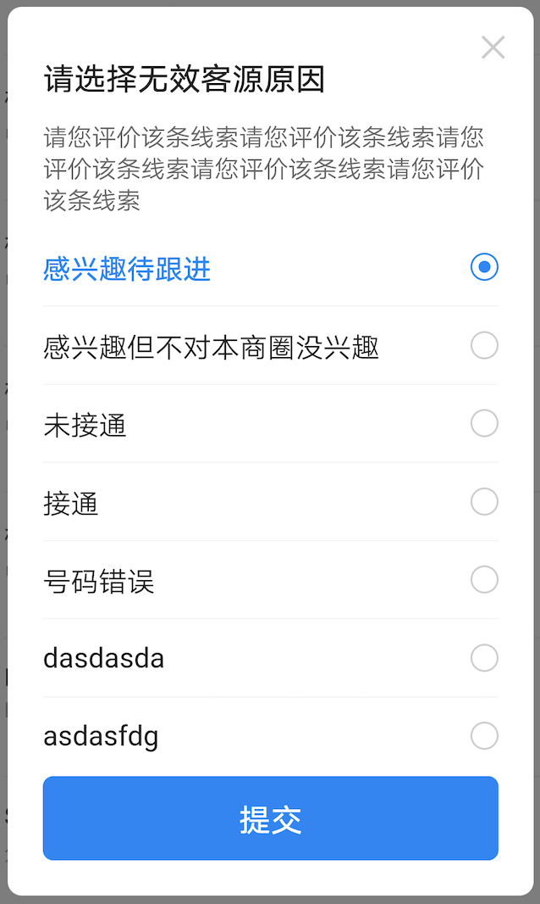

# BrnSingleSelectDialog

适用于单选弹窗列表

## 一、效果总览



## 二、描述

### 适用场景

适用于多选项中选择一个场景

## 三、构造函数及参数说明

### 构造函数

```dart
const BrnSingleSelectDialog(
      {this.isClose: true,
      this.title: "",
      this.messageText,
      this.messageWidget,
      required this.conditions,
      this.submitText: "提交",
      this.submitBgColor,
      this.onSubmitClick,
      this.onItemClick,
      this.checkedItem,
      this.customWidget,
      this.canDismissOnConfirmClick = true,
      this.isCustomFollowScroll = true});
```

### 参数说明

| **参数名**               | **参数类型**                        | **描述**                                                  | **是否必填** | **默认值** |
| ------------------------ | ----------------------------------- | --------------------------------------------------------- | ------------ | ---------- |
| isClose                  | bool                                | 用于控制弹窗是否相应电机外部关闭，true 关闭，false 不关闭 | 否           | true       |
| title                    | String                              | 弹窗标题名称                                              | 否           | ""         |
| messageText              | String?                             | 描述文案，优先级较 messageWidget 低，优先使用 messageWidget                                                | 否           |            |
| messageWidget            | Widget?                             | 描述 Widget                                          | 否           |            |
| conditions               | List<String>                        | 备选项数组                                                | 否           |            |
| checkedItem              | String                              | 选中的选项名称                                            | 否           |            |
| submitText               | String                              | 确定/提交 按钮文案                                        | 否           |            |
| submitBgColor            | Color                               | 提交按钮背景颜色                                          | 否           |            |
| customWidget             | Widget                              | 在单选列表底部自定义 Widget                               | 否           | null       |
| isCustomFollowScroll     | bool                                | 内容是否可滑动                                            | 否           | true       |
| canDismissOnConfirmClick | bool                                | 是否在点击时让 Diallog 消失                               | 否           | true       |
| onSubmitClick            | BrnSingleSelectOnSubmitCallback?    | 提交按钮点击的回调                                        | 否           |            |
| onItemClick              | BrnSingleSelectOnItemClickCallback? | item 的点击回调                                           | 否           |            |

## 三、代码演示

### 效果 1：单选弹窗


```dart
String hintText = "感兴趣待跟进";
  int selectedIndex = 0;
  var conditions = [
    "感兴趣待跟进",
    "感兴趣但不对本商圈没兴趣",
    "未接通",
    "接通",
    "号码错误",
    "dasdasda",
    "asdasfdg",
    "dadsadvq",
    "vzxczxc"
  ];
  showDialog(
          context: context,
          builder: (_) => StatefulBuilder(
                builder: (context, state) {
                  return BrnSingleSelectDialog(
                      isClose: true,
                      title: '请选择无效客源原因',
                      messageText: '请您评价该条线索请您评价该条线索请您评价该条线索请您评价该条线索请您评价该条线索',
                      conditions: conditions,
                      checkedItem: conditions[selectedIndex],
                      submitText: '提交',
                      isCustomFollowScroll: true,
                      customWidget: TextField(
                        //光标颜色
                        maxLines: 2,
                        cursorColor: Color(0xFF0984F9),
                        //光标圆角弧度
                        cursorRadius: Radius.circular(2.0),
                        style: TextStyle(fontSize: 14, color: Color(0xFF222222)),
                        maxLengthEnforcement: MaxLengthEnforcement.enforced,
                        onChanged: (value) {},
                        decoration: InputDecoration(
                          contentPadding: EdgeInsets.all(8.0),
                          hintText: hintText,
                          hintStyle:
                              TextStyle(fontSize: 14, color: Color(0xFFCCCCCC)),
                          enabledBorder: OutlineInputBorder(
                              borderRadius: BorderRadius.circular(2.0),
                              borderSide: BorderSide(
                                width: 0.5,
                                color: Color(0xFFCCCCCC),
                              )),
                          focusedBorder: OutlineInputBorder(
                              borderRadius: BorderRadius.circular(2.0),
                              borderSide: BorderSide(
                                width: 0.5,
                                color: Color(0xFFCCCCCC),
                              )),
                        ),
                      ),
                      onItemClick: (BuildContext context, int index) {
                        hintText = conditions[index];
                        selectedIndex = index;
                        state(() {});
                      },
                      onSubmitClick: (data) {
                        BrnToast.show(data!, context);
                      });
                },
              ));
```
