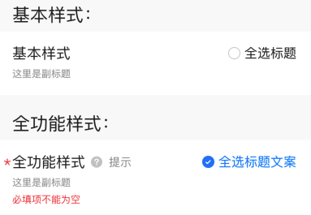
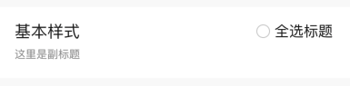

# BrnSelectAllTitle

全选类型类型表单项。

## 一、效果总览



## 二、描述

### 适用场景

1. 全选标题

2. 包含全选按钮

### 交互规则

1. 设置此录入项是否可编辑（禁用）。
2. 标题、副标题、右侧全选按钮区域，都支持自定义视图。
3. 右侧自定义区域时图限制最大高度 25。

### 注意事项

该组件不具备数据录入的功能，可以用来和其他表单项做拼装，以实现更复杂的功能。

## 三、构造函数及参数说明

### 构造函数


```dart
BrnSelectAllTitle({
  Key? key,
  this.title = "",
  this.subTitle,
  this.isRequire = false,
  this.isEdit = true,
  this.error = "",
  this.tipLabel,
  this.titleWidget,
  this.subTitleWidget,
  this.onTip,
  this.onSelectAll,
  this.selectText,
  this.selectTextWidget,
  this.selectState = true,
  this.themeData,
  this.customActionWidget,
}):super(key: key) {
  this.themeData ??= BrnFormItemConfig();
  this.themeData = BrnThemeConfigurator.instance
      .getConfig(configId: this.themeData!.configId)
      .formItemConfig
      .merge(this.themeData);
}
```
### 参数说明

| **参数名** | **参数类型** | **描述** | **是否必填** | **默认值** | **备注** |
| --- | --- | --- | --- | --- | --- |
| title | String | 录入项标题 | 否 | '' |  |
| titleWidget | Widget? | 录入项标题Widget | 否 | 无 |  |
| subTitle | String? | 录入项子标题 | 否 | 无 |  |
| subTitleWidget | Widget? | 录入项子标题Widget | 否 | 无 |  |
| tipLabel | String? | 录入项提示（问号图标&文案） 用户点击时触发onTip回调。 | 否 | 备注中类型3 | 1. 设置"空字符串"时展示问号图标 2. 设置"非空字符串"时展示问号图标&文案 3. 若不赋值或赋值为null时，不显示提示项 |
| error | String | 录入项错误提示 | 否 | '' |  |
| isRequire | bool | 录入项是否为必填项（展示`*`图标） 默认为 false 不必填 | 否 | false |  |
| isEdit | bool | 录入项 是否可编辑 | 否 | true | true：可编辑，false：禁用 |
| selectState | bool | 选中按钮的选中状态 | 否 | true |  |
| selectText | String? | “全选”文案 | 否 | 无 |  |
| selectTextWidget | Widget? | “全选”Widget | 否 | 无 |  |
| customActionWidget | Widget? | 右侧自定义Widget | 否 | 无 |  |
| onTip | VoidCallback? | 点击"？"图标回调 | 否 | 无 | 见**tipLabel**字段 |
| onSelectAll | OnBrnFormSelectAll? | 点击“全选”选中/取消 | 否 | 无 | void Function(int index, bool isSelect) |
| themeData | BrnFormItemConfig? | 表单主题配置 | 否 | 无 | |

## 四、代码演示

### 效果1：基本样式



```dart
BrnSelectAllTitle(
  title: "基本样式",
  subTitle: "这里是副标题",
  selectText: '全选标题',
  selectState: false,
  onSelectAll: (int index, bool isSelect){
    BrnToast.show("全选回调_onSelectAll", context);
  },
  onTip: () {
    BrnToast.show("点击触发回调_onTip", context);
  },
),
```

### 效果2：全功能样式


```dart
BrnSelectAllTitle(
  error: "必填项不能为空",
  title: "全功能样式",
  subTitle: "这里是副标题",
  selectText: '全选标题文案',
  tipLabel: "提示",
  isRequire: true,
  customActionWidget: Container(
    color:Colors.lightBlue,
    child: Center(
      child: Text('我是自定义视图', style: TextStyle(color: Colors.white))
    ),
  ),
  onSelectAll: (int index, bool isSelect){
    BrnToast.show("全选回调_onSelectAll", context);
  },
  onTip: () {
    BrnToast.show("点击触发回调_onTip", context);
  },
),
```
