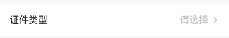
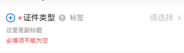

# BrnTextSelectFormItem

用于数据选择的情况

## 一、效果总览


## 二、描述

### 适用场景

用于选择数据的情况，包括"标题"、"副标题"、"错误信息提示"、"必填项提示"、"添加/删除按钮"、"消息提示"、"单选项"等元素。

### 交互规则

1. 可设置是否必填
2. 右侧箭头处出发选择数据能力
3. 若校验不过，可展示错误信息

### 使用规范

一般用于数据录入页面

## 三、构造函数及参数说明

### 构造函数

```dart
BrnTextSelectFormItem({
  Key? key,
  this.label,
  this.title: "",
  this.subTitle,
  this.tipLabel,
  this.prefixIconType: BrnPrefixIconType.normal,
  this.error: "",
  this.isEdit: true,
  this.isRequire: false,
  this.onAddTap,
  this.onRemoveTap,
  this.onTip,
  this.hint: "请选择",
  this.value,
  this.valueMaxLines = 1,
  this.titleMaxLines,
  this.onTap,
  this.themeData,
}) : super(key: key) {
  this._isAutoLayout = false;
  this.themeData ??= BrnFormItemConfig();
  this.themeData = BrnThemeConfigurator.instance
      .getConfig(configId: this.themeData!.configId)
      .formItemConfig
      .merge(this.themeData);
}
```

### 参数说明：

| **参数名** | **参数类型** | **描述** | **是否必填** | **默认值** | **备注** |
| --- | --- | --- | --- | --- | --- |
| label | String? | 录入项的唯一标识，主要用于录入类型页面框架中 | 否 | 无 |  |
| type | Stirng | 录入项类型，主要用于录入类型页面框架中 | 否 | BrnInputItemType.textSelectInputType | 外部可根据此字段判断表单项类型 |
| title | String | 录入项标题 | 否 | '' |  |
| subTitle | String? | 录入项子标题 | 否 | 无 |  |
| tipLabel | String? | 录入项提示（问号图标&文案） 用户点击时触发onTip回调。 | 否 | 备注中类型3 | 1. 设置"空字符串"时展示问号图标 2. 设置"非空字符串"时展示问号图标&文案 3. 若不赋值或赋值为null时，不显示提示项 |
| prefixIconType | String | 录入项前缀图标样式 "添加项" "删除项" 详见 **BrnPrefixIconType** 类 | 否 | BrnPrefixIconType.normal | 1. 不展示图标：BrnPrefixIconType.normal 2. 展示加号图标：BrnPrefixIconType.add 3. 展示减号图标：BrnPrefixIconType.remove |
| error | String | 录入项错误提示 | 否 | '' |  |
| isRequire | bool | 录入项是否为必填项（展示`*`图标），默认为 false 不必填 | 否 | false |  |
| isEdit | bool | 录入项 是否可编辑 | 否 | true | true：可编辑false：禁用 |
| onAddTap | VoidCallback? | 点击"+"图标回调 | 否 | 无 | 见**prefixIconType**字段 |
| onRemoveTap | VoidCallback? | 点击"-"图标回调 | 否 | 无 | 见**prefixIconType**字段 |
| onTip | VoidCallback? | 点击"？"图标回调 | 否 | 无 | 见**tipLabel**字段 |
| onTap | VoidCallback? | 点击录入区回调 | 否 | 无 |  |
| hint | String | 录入项 hint 提示 | 否 | '请选择' |  |
| value | String? | 录入项的值 | 否 | 无 |  |
| valueMaxLines | int | 选中文本最大行数 | 否 | 1 |  |
| titleMaxLines | int? | title最大行数 | 否 | 无 |  |
| layoutRatio | double? | 行布局左:右比例值，左边「标题+问号+提示语」  右边「选项值」，例如  左:右 = 6:4   则 ratio = 1.5 | 否 | 当左右内容超出默认比例且「有」提示语，则按比例  6:4 布局，当左右内容超出默认比例且「无」提示语，则按比例  4:6 布局，有用户自定义比例时用用户自定义比例 |  |
| themeData | BrnFormItemConfig? | 表单主题配置 | 否 | 无 | |


### 其他数据说明:

#### BrnPrefixIconType:

```dart
class BrnPrefixIconType {
  static const String normal = "type_normal";
  static const String add = "type_add";
  static const String remove = "type_remove";
}
```
## 四、代码演示

### 效果1：基本样式


```dart
BrnTextSelectFormItem(
  title: "证件类型",
  onTip: () {
    BrnToast.show("点击触发onTip回调", context);
  },
  onAddTap: () {
    BrnToast.show("点击触发onAddTap回调", context);
  },
  onRemoveTap: () {
    BrnToast.show("点击触发onRemoveTap回调", context);
  },
  onTap: () {
    BrnToast.show("点击触发回调_onTap", context);
  },
),
```
### 效果2：全功能样式


```dart
BrnTextSelectFormItem(
  prefixIconType: BrnPrefixIconType.add,
  isRequire: true,
  error: "必填项不能为空",
  title: "证件类型",
  subTitle: "这里是副标题",
  tipLabel: "标签",
  onTip: () {
    BrnToast.show("点击触发onTip回调", context);
  },
  onAddTap: () {
    BrnToast.show("点击触发onAddTap回调", context);
  },
  onRemoveTap: () {
    BrnToast.show("点击触发onRemoveTap回调", context);
  },
  onTap: () {
    BrnToast.show("点击触发回调_onTap", context);
  },
)
```
### 效果3：无错误提示样式


```dart
BrnTextSelectFormItem(
  prefixIconType: BrnPrefixIconType.add,
  isRequire: true,
  title: "证件类型",
  subTitle: "这里是副标题",
  tipLabel: "标签",
  onTip: () {
    BrnToast.show("点击触发onTip回调", context);
  },
  onAddTap: () {
    BrnToast.show("点击触发onAddTap回调", context);
  },
  onRemoveTap: () {
    BrnToast.show("点击触发onRemoveTap回调", context);
  },
  onTap: () {
    BrnToast.show("点击触发回调_onTap", context);
  },
)
```
### 效果4：autolayout 样式



```dart
BrnTextSelectFormItem.autoLayout(
  prefixIconType: BrnPrefixIconType.add,
  isRequire: true,
  error: "必填项不能为空",
  title: "证件类型",
  subTitle: "这里是副标题",
  tipLabel: "标签",
  onTip: () {
    BrnToast.show("点击触发onTip回调", context);
  },
  onAddTap: () {
    BrnToast.show("点击触发onAddTap回调", context);
  },
  onRemoveTap: () {
    BrnToast.show("点击触发onRemoveTap回调", context);
  },
  onTap: () {
    BrnToast.show("点击触发回调_onTap", context);
  },
)
```