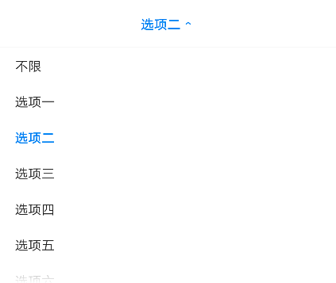
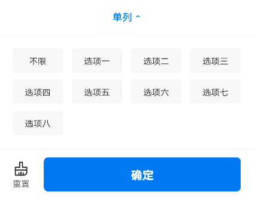

# BrnSimpleSelection

区间+输入混合一级筛选

## 一、效果总览




## 二、描述

### 适用场景

简单筛选列表，包含单选和多选两种示例，适合简单的业务场景。

## 三、构造函数及参数说明

### 构造函数

#### 单选

```dart
BrnSimpleSelection.radio({
  Key key,
  this.menuName,
  this.menuKey = defaultMenuKey,
  this.defaultValue,
  this.items,
  this.maxSelectedCount = 1,
  @required this.onSimpleSelectionChanged,
  this.onMenuItemClick,
}) : super(key: key) {
  this.isRadio = true;
}
```

#### 多选

```dart
BrnSimpleSelection.checkbox({
  this.menuName,
  this.menuKey,
  this.defaultValue,
  this.maxSelectedCount,
  this.items,
  Key key,
  @required this.onSimpleSelectionChanged,
  this.onMenuItemClick,
  }) : super(key: key) {
  this.isRadio = false;
}
```

### 参数说明

| **参数名**               | **参数类型**                         | **描述**                                                   | **是否必填** | **默认值**                                  |
| ------------------------ | ------------------------------------ | ---------------------------------------------------------- | ------------ | ------------------------------------------- |
| menuName                 | String                               | 标题文案                                                   | 否           | 无                                          |
| menuKey                  | String                               | 回传给服务端 Key                                           | 否           | 无                                          |
| defaultValue             | String                               | 默认选中项值                                               | 否           | 无                                          |
| maxSelectedCount         | int                                  | 最大选中个数                                               | 否           | radio 模式 默认 65535 checkbox 模式不设置   |
| items                    | `List<ItemEntity>`                   | 选项列表                                                   | 否           |                                             |
| onSimpleSelectionChanged | BrnSimpleSelectionOnSelectionChanged | 选择回调                                                   | 否           |                                             |
| onMenuItemClick          | VoidCallback                         | 菜单点击事件                                               | 否           |                                             |
| isRadio                  | bool                                 | 是否单选 默认 radio 模式 is true ， checkbox 模式 is false | 否           | radio 模式默认 true checkbox 模式默认 false |

## 四、代码演示

### 效果 1


```dart
BrnSimpleSelection.radio(
  menuName: widget._filterData.name,
  menuKey: widget._filterData.key ?? defaultMenuKey,
  items: widget._filterData.children,
  defaultValue: widget._filterData.defaultValue,
  onSimpleSelectionChanged: (
      List<ItemEntity> filterParams) {
    BrnToast.show(filterParams.map((e) => e.value).toList().join(','), context);
  },
)
```

```dart
"list": [
  {
    "title": "单列",
    "key": "one_list_key",
    "type": "radio",
    "defaultValue": "",
    "value": "",
    "children": [
      {
        "title": "不限",
        "key": "",
        "type": "unlimit",
        "defaultValue": "",
        "value": ""
      },
      {
        "title": "选项一",
        "key": "",
        "type": "radio",
        "defaultValue": "",
        "value": "1"
      },
      {
        "title": "选项二",
        "key": "",
        "type": "radio",
        "defaultValue": "",
        "value": "2"
      },
      {
        "title": "选项三",
        "key": "",
        "type": "radio",
        "defaultValue": "",
        "value": "3"
      },
      {
        "title": "选项四",
        "key": "",
        "type": "radio",
        "defaultValue": "",
        "value": "4"
      },
      {
        "title": "选项五",
        "key": "",
        "type": "radio",
        "defaultValue": "",
        "value": "5"
      },
      {
        "title": "选项六",
        "key": "",
        "type": "radio",
        "defaultValue": "",
        "value": "6"
      },
      {
        "title": "选项七",
        "key": "",
        "type": "radio",
        "defaultValue": "",
        "value": "7"
      },
      {
        "title": "选项八",
        "key": "",
        "type": "radio",
        "defaultValue": "",
        "value": "8"
      }
    ]
  }
]
```

### 效果 2


```dart
BrnSimpleSelection.checkbox(
  menuName: widget._filterData.name,
  menuKey: widget._filterData.key ?? defaultMenuKey,
  items: widget._filterData.children,
  maxSelectedCount: 4,
  defaultValue: widget._filterData.defaultValue,
  onSimpleSelectionChanged: (
      List<ItemEntity> filterParams) {
    BrnToast.show(filterParams.map((e) => e.value).toList().join(','), context);
  },
)
```

```dart
"list": [
  {
    "title": "单列",
    "key": "one_list_key",
    "type": "radio",
    "defaultValue": "",
    "value": "",
    "children": [
      {
        "title": "不限",
        "key": "",
        "type": "unlimit",
        "defaultValue": "",
        "value": ""
      },
      {
        "title": "选项一",
        "key": "",
        "type": "radio",
        "defaultValue": "",
        "value": "1"
      },
      {
        "title": "选项二",
        "key": "",
        "type": "radio",
        "defaultValue": "",
        "value": "2"
      },
      {
        "title": "选项三",
        "key": "",
        "type": "radio",
        "defaultValue": "",
        "value": "3"
      },
      {
        "title": "选项四",
        "key": "",
        "type": "radio",
        "defaultValue": "",
        "value": "4"
      },
      {
        "title": "选项五",
        "key": "",
        "type": "radio",
        "defaultValue": "",
        "value": "5"
      },
      {
        "title": "选项六",
        "key": "",
        "type": "radio",
        "defaultValue": "",
        "value": "6"
      },
      {
        "title": "选项七",
        "key": "",
        "type": "radio",
        "defaultValue": "",
        "value": "7"
      },
      {
        "title": "选项八",
        "key": "",
        "type": "radio",
        "defaultValue": "",
        "value": "8"
      }
    ]
  }
]
```
